# Master da verificare — prima parte Creative Direction

40 varianti usano estrazioni provvisorie dai layout. Le altre immagini usano master del repository o dello ZIP, incluse le due cover Holden ingrandite su approvazione di Francesco.

L’ultimo riquadro di Battistoni pagina 5 è tagliato dal bordo inferiore dello screenshot: serve il file completo o la continuazione. Non è stata inventata la parte mancante.

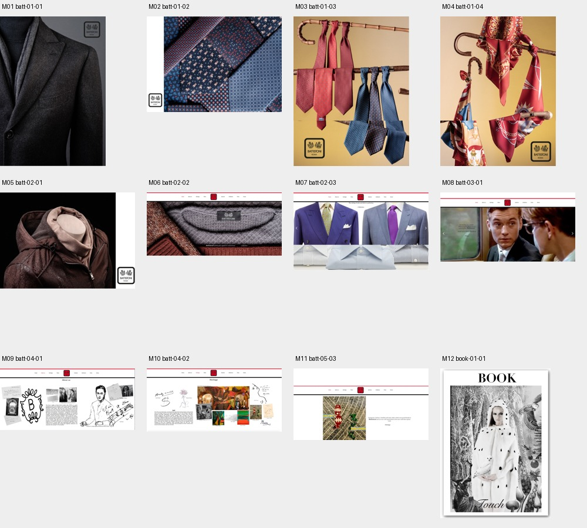

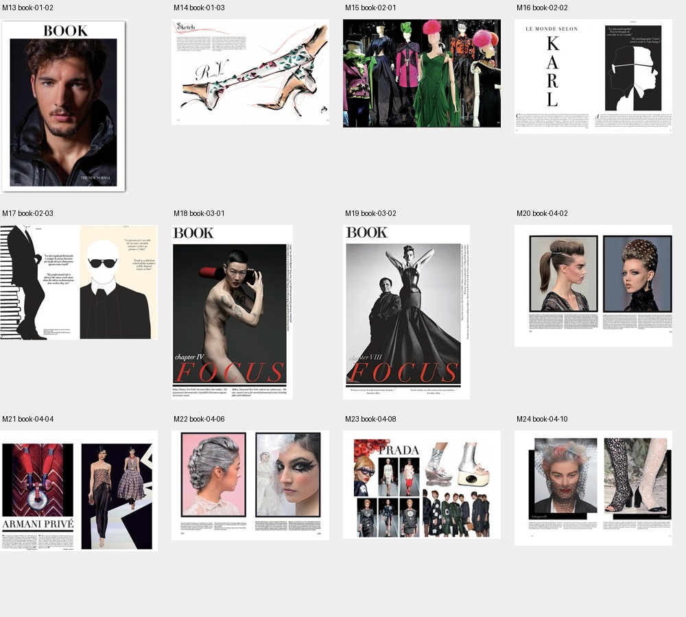

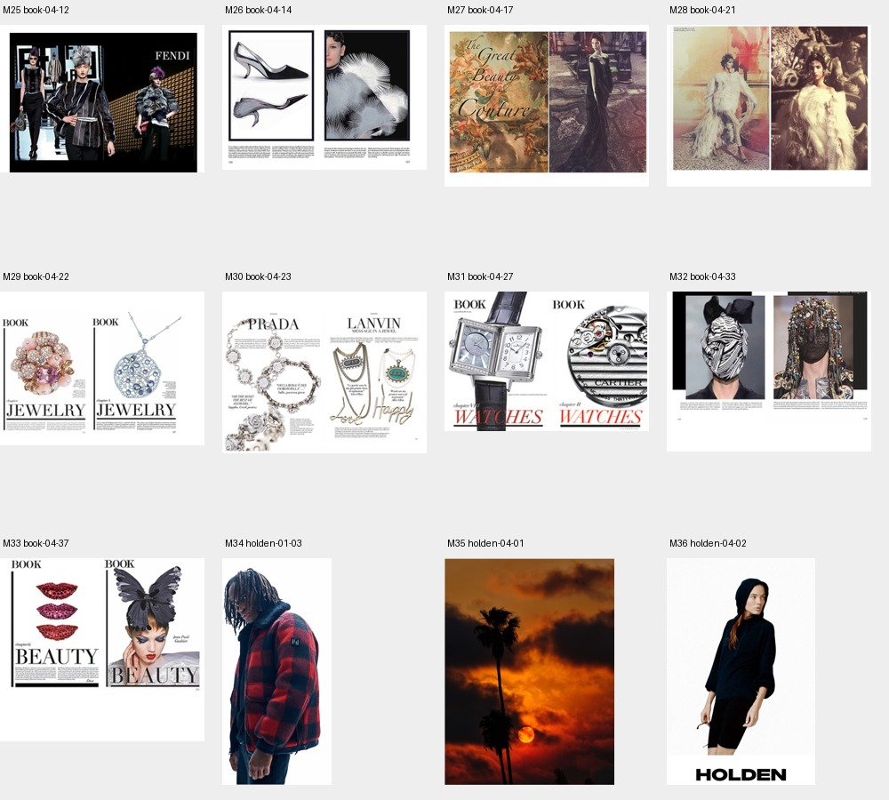

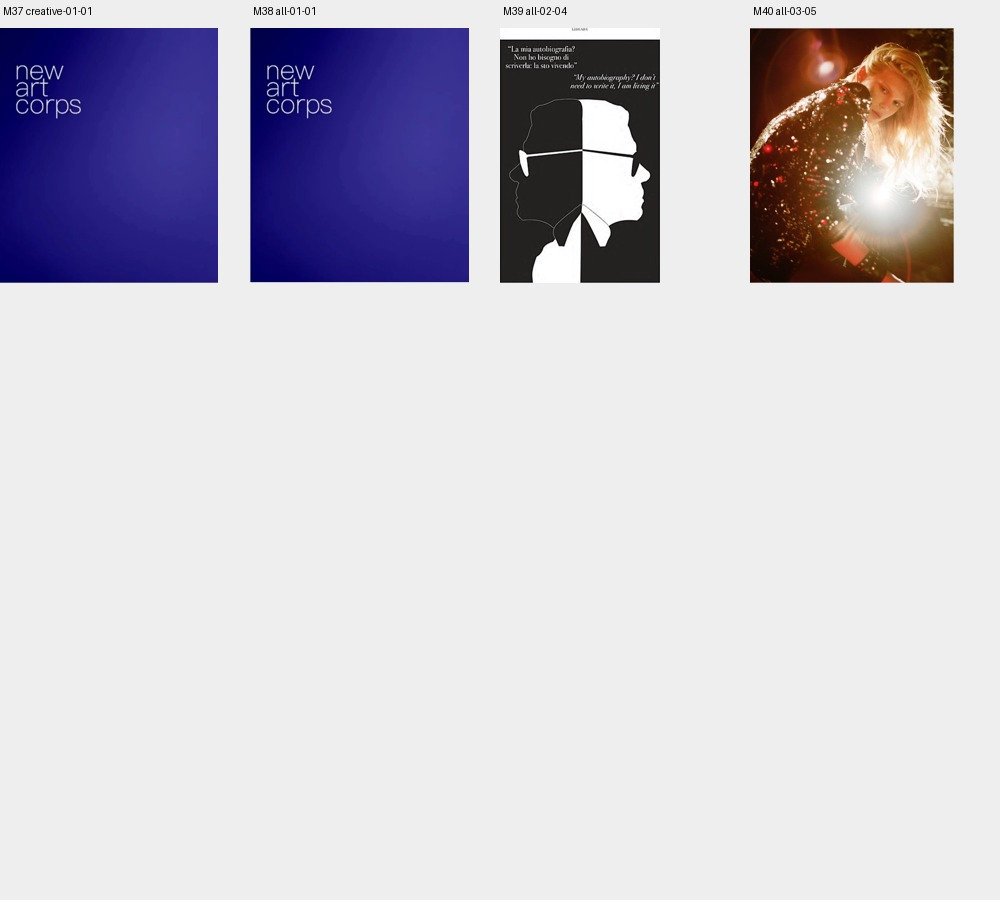

## M01 · batt-01-01

Riferimento: `Battistoni_Layout/PAGINA X LAYOUT BATTISTONI1.jpg`.

Richiedere il master della variante esatta, mantenendo impaginazione, testo e formato mostrati.

## M02 · batt-01-02

Riferimento: `Battistoni_Layout/PAGINA X LAYOUT BATTISTONI1.jpg`.

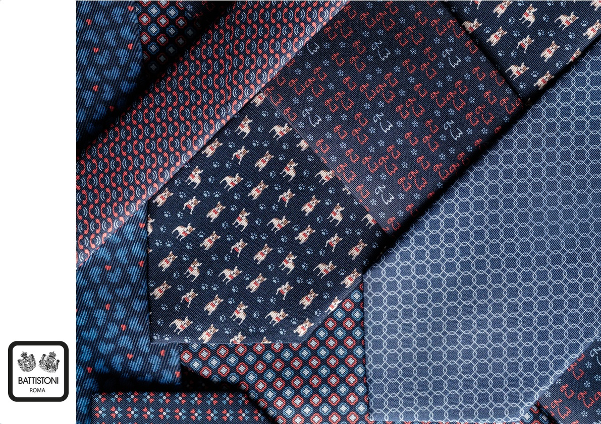

Richiedere il master della variante esatta, mantenendo impaginazione, testo e formato mostrati.

## M03 · batt-01-03

Riferimento: `Battistoni_Layout/PAGINA X LAYOUT BATTISTONI1.jpg`.

Richiedere il master della variante esatta, mantenendo impaginazione, testo e formato mostrati.

## M04 · batt-01-04

Riferimento: `Battistoni_Layout/PAGINA X LAYOUT BATTISTONI1.jpg`.

Richiedere il master della variante esatta, mantenendo impaginazione, testo e formato mostrati.

## M05 · batt-02-01

Riferimento: `Battistoni_Layout/PAGINA X LAYOUT BATTISTONI2.jpg`.

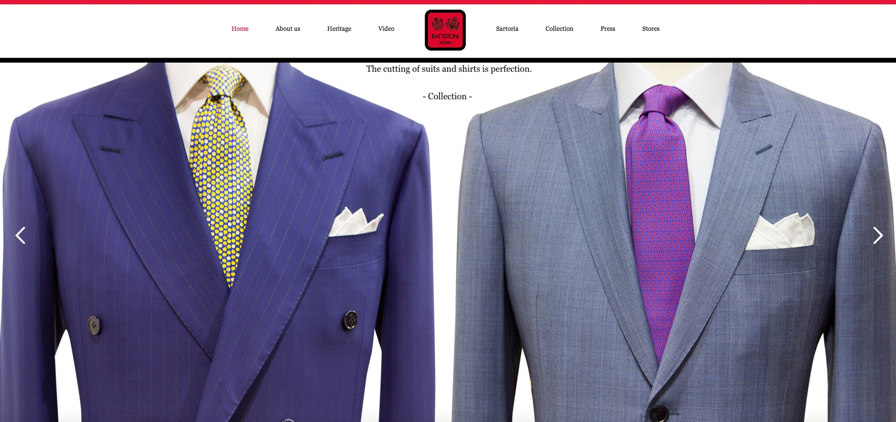

Richiedere il master della variante esatta, mantenendo impaginazione, testo e formato mostrati.

## M06 · batt-02-02

Riferimento: `Battistoni_Layout/PAGINA X LAYOUT BATTISTONI2.jpg`.

Richiedere il master della variante esatta, mantenendo impaginazione, testo e formato mostrati.

## M07 · batt-02-03

Riferimento: `Battistoni_Layout/PAGINA X LAYOUT BATTISTONI2.jpg`.

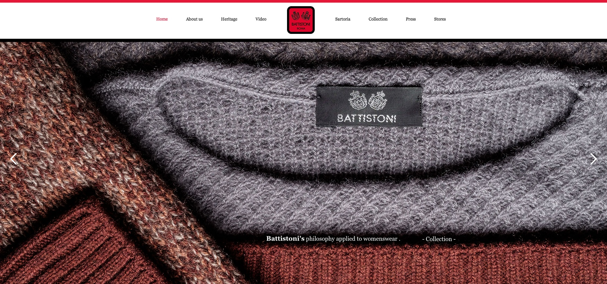

Richiedere il master della variante esatta, mantenendo impaginazione, testo e formato mostrati.

## M08 · batt-03-01

Riferimento: `Battistoni_Layout/PAGINA X LAYOUT BATTISTONI3.jpg`.

Richiedere il master della variante esatta, mantenendo impaginazione, testo e formato mostrati.

## M09 · batt-04-01

Riferimento: `Battistoni_Layout/PAGINA X LAYOUT BATTISTONI4.jpg`.

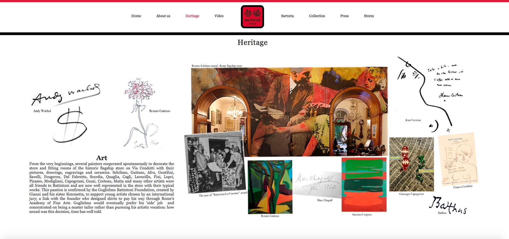

Richiedere il master della variante esatta, mantenendo impaginazione, testo e formato mostrati.

## M10 · batt-04-02

Riferimento: `Battistoni_Layout/PAGINA X LAYOUT BATTISTONI4.jpg`.

Richiedere il master della variante esatta, mantenendo impaginazione, testo e formato mostrati.

## M11 · batt-05-03

Riferimento: `Battistoni_Layout/PAGINA X LAYOUT BATTISTONI5.jpg`.

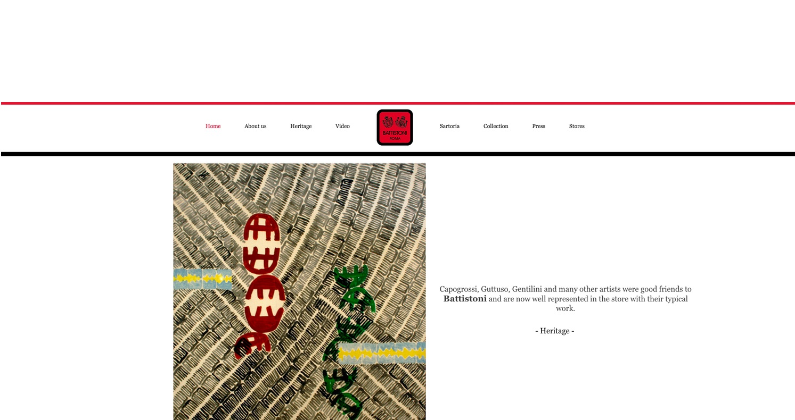

Final source screenshot ends before this website design is complete. Exact full image/continuation must be requested; provisional supplied portion retained.

## M12 · book-01-01

Riferimento: `Book_Magazine_Layout/PAGINA X LAYOUT BOOK1.jpg`.

Richiedere il master della variante esatta, mantenendo impaginazione, testo e formato mostrati.

## M13 · book-01-02

Riferimento: `Book_Magazine_Layout/PAGINA X LAYOUT BOOK1.jpg`.

Richiedere il master della variante esatta, mantenendo impaginazione, testo e formato mostrati.

## M14 · book-01-03

Riferimento: `Book_Magazine_Layout/PAGINA X LAYOUT BOOK1.jpg`.

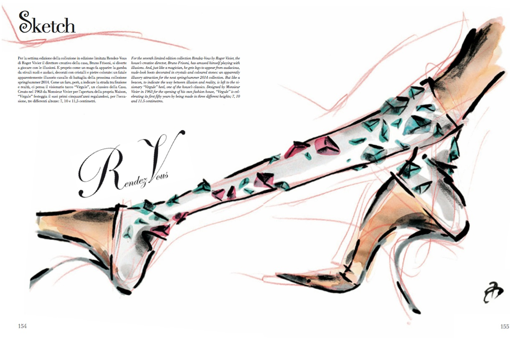

Richiedere il master della variante esatta, mantenendo impaginazione, testo e formato mostrati.

## M15 · book-02-01

Riferimento: `Book_Magazine_Layout/PAGINA X LAYOUT BOOK2.jpg`.

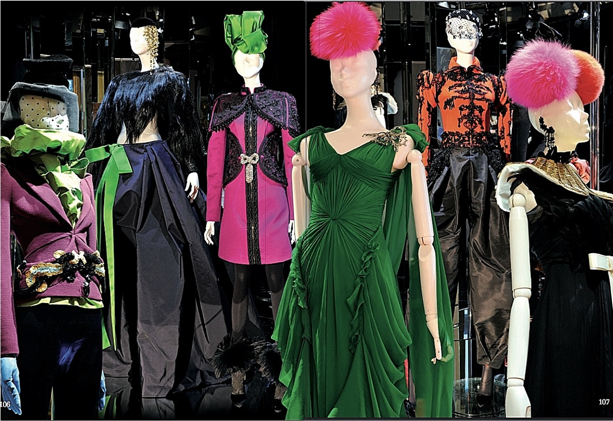

Richiedere il master della variante esatta, mantenendo impaginazione, testo e formato mostrati.

## M16 · book-02-02

Riferimento: `Book_Magazine_Layout/PAGINA X LAYOUT BOOK2.jpg`.

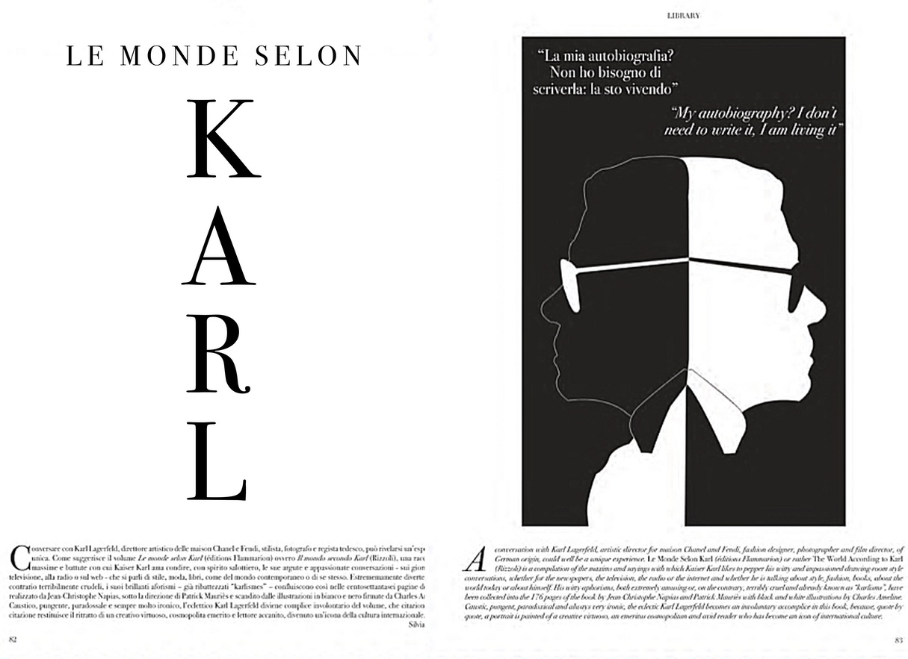

Richiedere il master della variante esatta, mantenendo impaginazione, testo e formato mostrati.

## M17 · book-02-03

Riferimento: `Book_Magazine_Layout/PAGINA X LAYOUT BOOK2.jpg`.

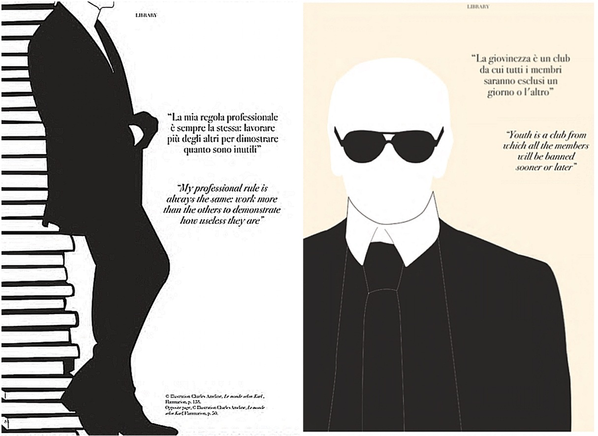

Richiedere il master della variante esatta, mantenendo impaginazione, testo e formato mostrati.

## M18 · book-03-01

Riferimento: `Book_Magazine_Layout/PAGINA X LAYOUT BOOK3.jpg`.

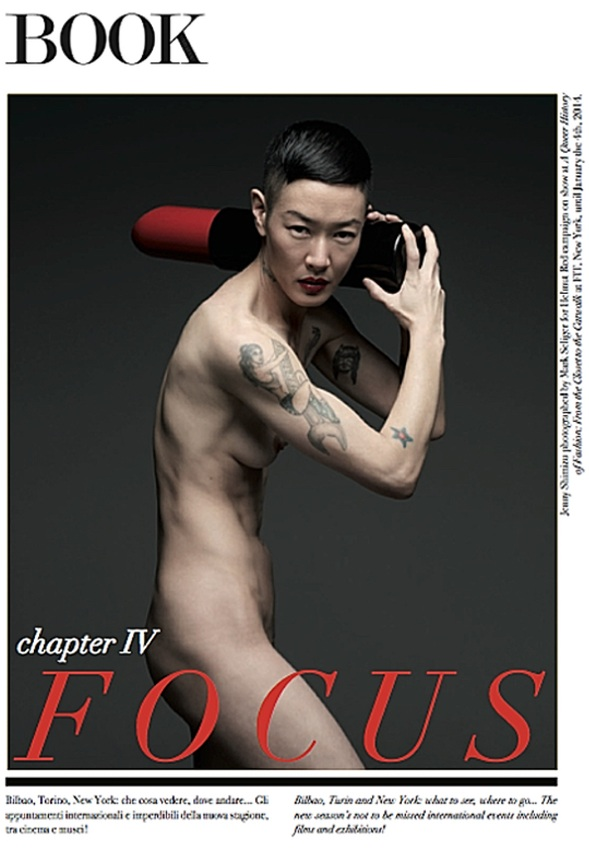

Richiedere il master della variante esatta, mantenendo impaginazione, testo e formato mostrati.

## M19 · book-03-02

Riferimento: `Book_Magazine_Layout/PAGINA X LAYOUT BOOK3.jpg`.

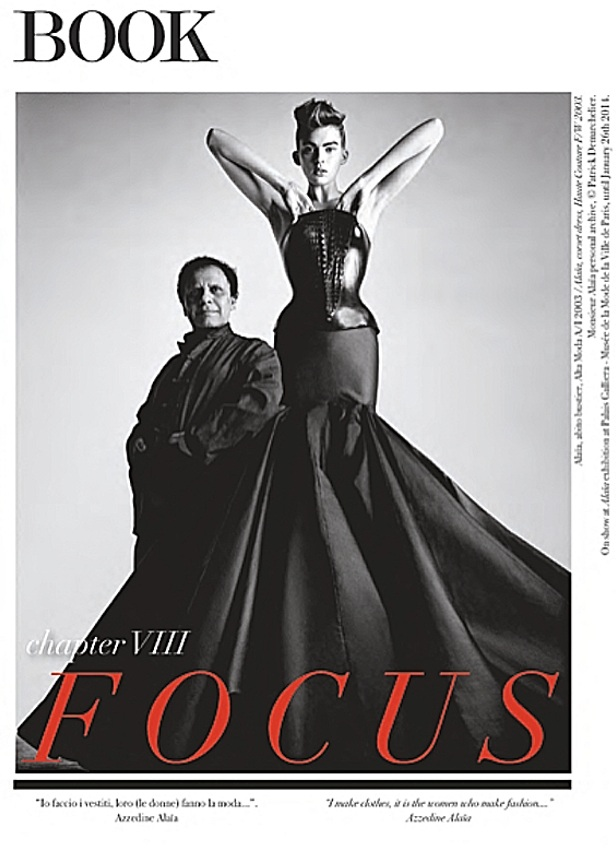

Richiedere il master della variante esatta, mantenendo impaginazione, testo e formato mostrati.

## M20 · book-04-02

Riferimento: `Book_Magazine_Layout/PAGINA X LAYOUT BOOK4.jpg`.

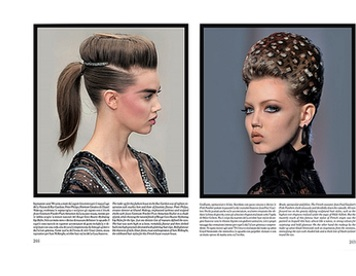

Richiedere il master della variante esatta, mantenendo impaginazione, testo e formato mostrati.

## M21 · book-04-04

Riferimento: `Book_Magazine_Layout/PAGINA X LAYOUT BOOK4.jpg`.

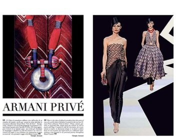

Richiedere il master della variante esatta, mantenendo impaginazione, testo e formato mostrati.

## M22 · book-04-06

Riferimento: `Book_Magazine_Layout/PAGINA X LAYOUT BOOK4.jpg`.

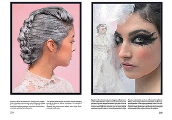

Richiedere il master della variante esatta, mantenendo impaginazione, testo e formato mostrati.

## M23 · book-04-08

Riferimento: `Book_Magazine_Layout/PAGINA X LAYOUT BOOK4.jpg`.

Richiedere il master della variante esatta, mantenendo impaginazione, testo e formato mostrati.

## M24 · book-04-10

Riferimento: `Book_Magazine_Layout/PAGINA X LAYOUT BOOK4.jpg`.

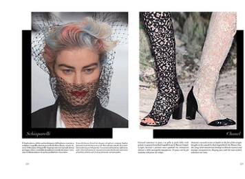

Richiedere il master della variante esatta, mantenendo impaginazione, testo e formato mostrati.

## M25 · book-04-12

Riferimento: `Book_Magazine_Layout/PAGINA X LAYOUT BOOK4.jpg`.

Richiedere il master della variante esatta, mantenendo impaginazione, testo e formato mostrati.

## M26 · book-04-14

Riferimento: `Book_Magazine_Layout/PAGINA X LAYOUT BOOK4.jpg`.

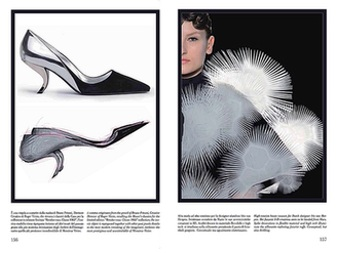

Richiedere il master della variante esatta, mantenendo impaginazione, testo e formato mostrati.

## M27 · book-04-17

Riferimento: `Book_Magazine_Layout/PAGINA X LAYOUT BOOK4.jpg`.

Richiedere il master della variante esatta, mantenendo impaginazione, testo e formato mostrati.

## M28 · book-04-21

Riferimento: `Book_Magazine_Layout/PAGINA X LAYOUT BOOK4.jpg`.

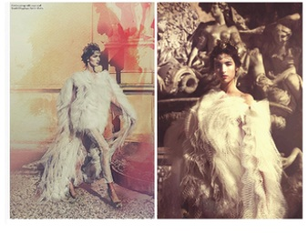

Richiedere il master della variante esatta, mantenendo impaginazione, testo e formato mostrati.

## M29 · book-04-22

Riferimento: `Book_Magazine_Layout/PAGINA X LAYOUT BOOK4.jpg`.

Richiedere il master della variante esatta, mantenendo impaginazione, testo e formato mostrati.

## M30 · book-04-23

Riferimento: `Book_Magazine_Layout/PAGINA X LAYOUT BOOK4.jpg`.

Richiedere il master della variante esatta, mantenendo impaginazione, testo e formato mostrati.

## M31 · book-04-27

Riferimento: `Book_Magazine_Layout/PAGINA X LAYOUT BOOK4.jpg`.

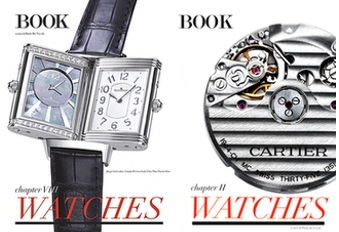

Richiedere il master della variante esatta, mantenendo impaginazione, testo e formato mostrati.

## M32 · book-04-33

Riferimento: `Book_Magazine_Layout/PAGINA X LAYOUT BOOK4.jpg`.

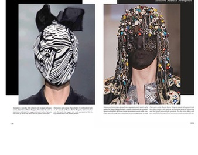

Richiedere il master della variante esatta, mantenendo impaginazione, testo e formato mostrati.

## M33 · book-04-37

Riferimento: `Book_Magazine_Layout/PAGINA X LAYOUT BOOK4.jpg`.

Richiedere il master della variante esatta, mantenendo impaginazione, testo e formato mostrati.

## M34 · holden-01-03

Riferimento: `Layout_Holden/PAGINA X LAYOUT HOLDEN1.jpg`.

Richiedere il master della variante esatta, mantenendo impaginazione, testo e formato mostrati.

## M35 · holden-04-01

Riferimento: `Layout_Holden/PAGINA X LAYOUT HOLDEN4.jpg`.

Richiedere il master della variante esatta, mantenendo impaginazione, testo e formato mostrati.

## M36 · holden-04-02

Riferimento: `Layout_Holden/PAGINA X LAYOUT HOLDEN4.jpg`.

Richiedere il master della variante esatta, mantenendo impaginazione, testo e formato mostrati.

## M37 · creative-01-01

Riferimento: `Layout_Creative_Direction/PAGINA X LAYOUT CD1.jpg`.

Richiedere il master della variante esatta, mantenendo impaginazione, testo e formato mostrati.

## M38 · all-01-01

Riferimento: `Layout_Work_Generale/PAGINA X LAYOUT WORK GENERALE1.jpg`.

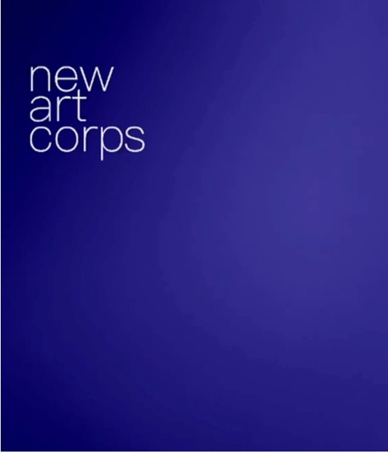

Richiedere il master della variante esatta, mantenendo impaginazione, testo e formato mostrati.

## M39 · all-02-04

Riferimento: `Layout_Work_Generale/PAGINA X LAYOUT WORK GENERALE2.jpg`.

Richiedere il master della variante esatta, mantenendo impaginazione, testo e formato mostrati.

## M40 · all-03-05

Riferimento: `Layout_Work_Generale/PAGINA X LAYOUT WORK GENERALE3.jpg`.

Richiedere il master della variante esatta, mantenendo impaginazione, testo e formato mostrati.
