# Master e varianti fotografiche da richiedere a Tommy

Controllo del 6 ottobre 2026. Le immagini provvisorie sono estratte dai layout di Styling.zip, come autorizzato da Francesco. Non sono immagini generate.

75 varianti da verificare/sostituire, distribuite su 103 asset utilizzati. 22 immagini riutilizzano fotografie già presenti. Una variante presente nel mockup può differire dall'asset disponibile per ritaglio, impaginazione pubblicitaria, testo o formato; la presenza di un asset simile non conferma che sia il master esatto.

Le tavole numerate servono a identificare visivamente le richieste. Non è necessario chiedere di nuovo due volte la stessa immagine: gli utilizzi riconosciuti come duplicati sono raggruppati. Per ogni richiesta occorre il file fotografico completo nella variante mostrata, possibilmente alla risoluzione originale.

La pagina 1 del progetto Rolex non è inclusa nell'archivio: non è stata inventata. I due annunci tagliati sul bordo superiore della pagina 2 appartengono alla parte precedente e non sono stati trasformati in fotografie incomplete.

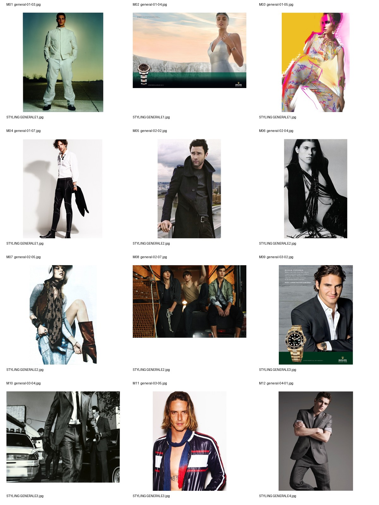

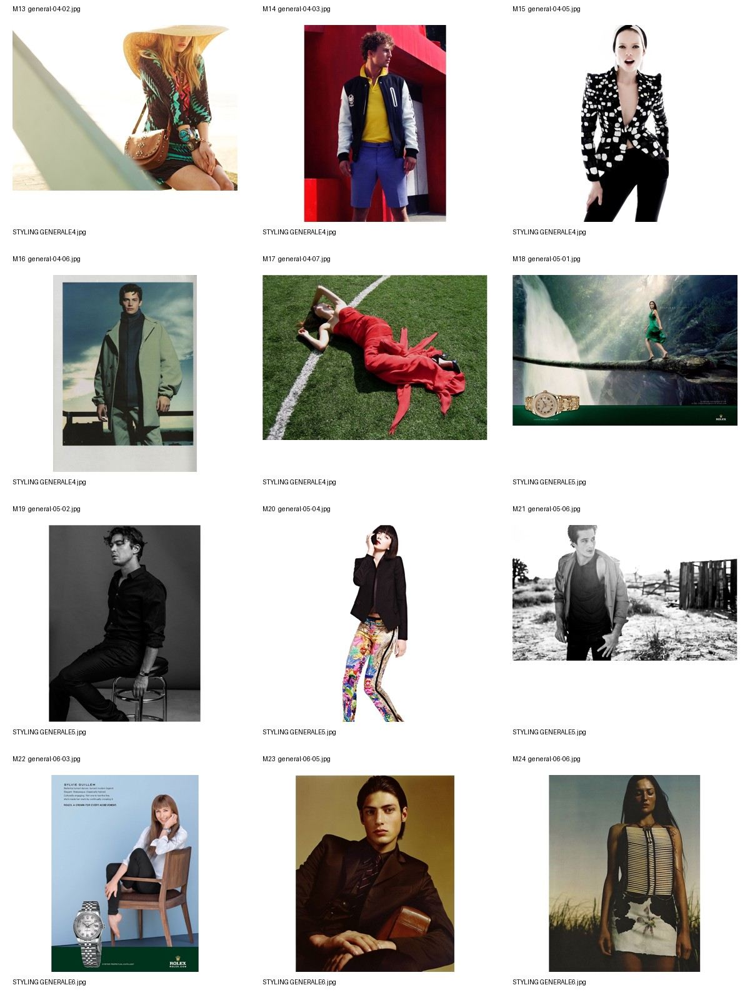

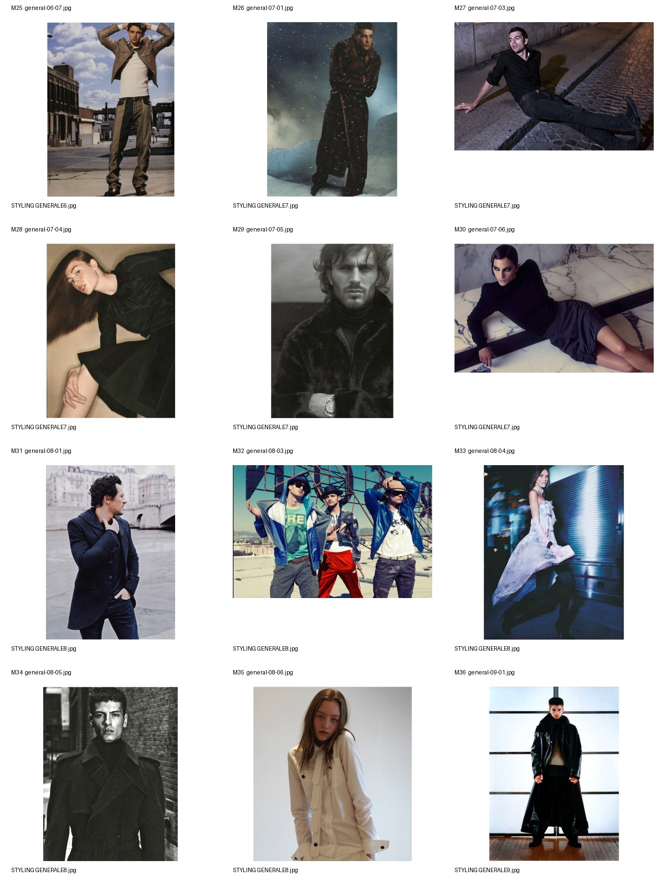

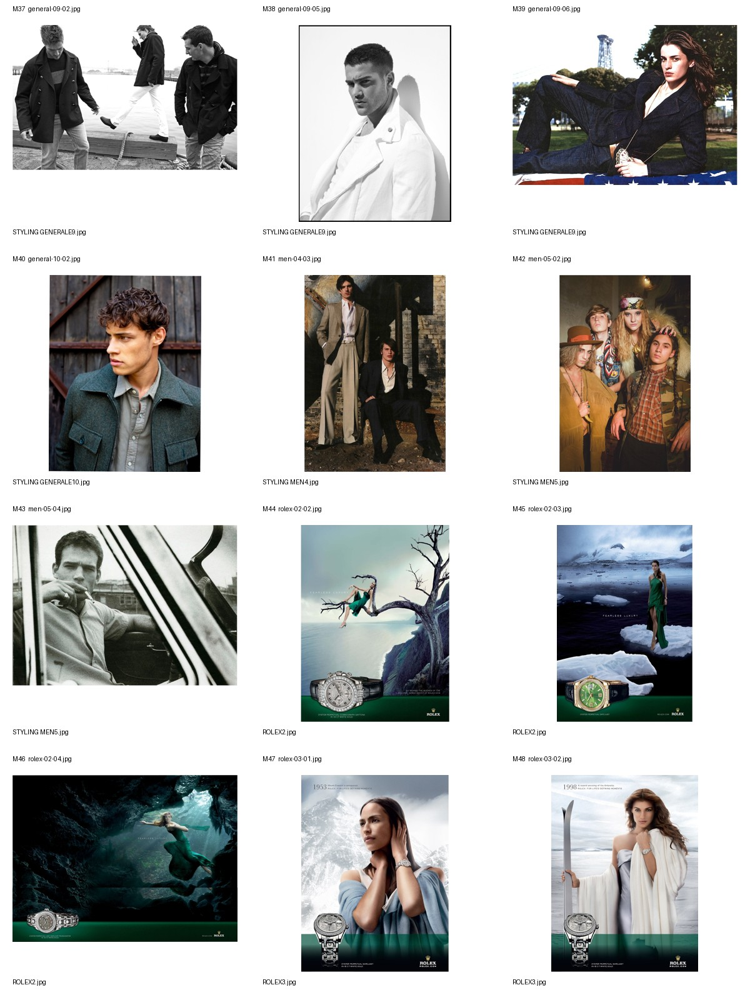

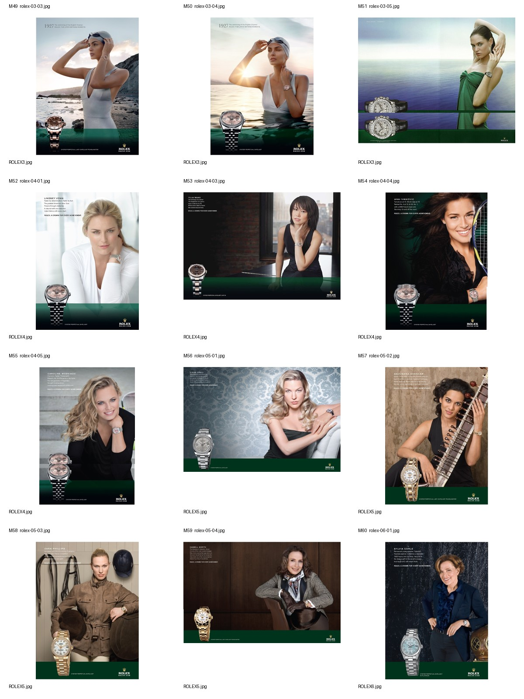

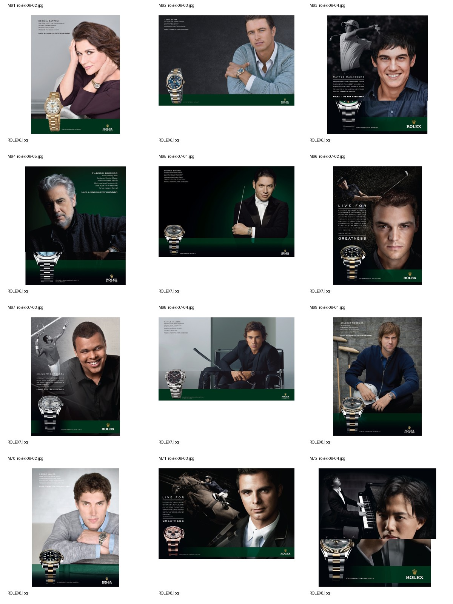

## M01 · general-01-03

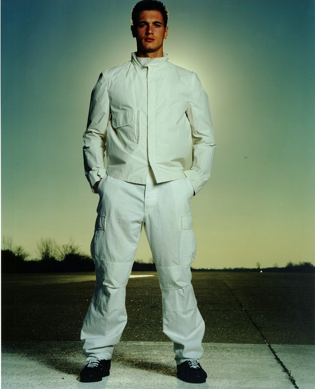

Riferimento: `PAGINA X LAYOUT STYLING GENERALE1.jpg`.

Utilizzi: `general-01-03.jpg`.

Richiesta: master completo della variante mostrata, mantenendo fotografia, formato ed eventuale testo pubblicitario.

## M02 · general-01-04

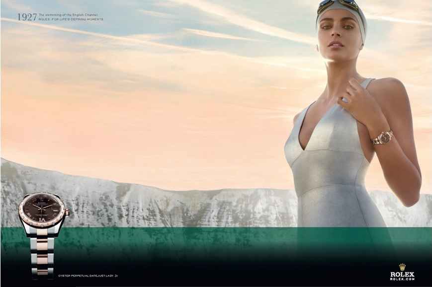

Riferimento: `PAGINA X LAYOUT STYLING GENERALE1.jpg`.

Utilizzi: `general-01-04.jpg`, `rolex-work-01.jpg`.

Richiesta: master completo della variante mostrata, mantenendo fotografia, formato ed eventuale testo pubblicitario.

## M03 · general-01-05

Riferimento: `PAGINA X LAYOUT STYLING GENERALE1.jpg`.

Utilizzi: `general-01-05.jpg`.

Richiesta: master completo della variante mostrata, mantenendo fotografia, formato ed eventuale testo pubblicitario.

## M04 · general-01-07

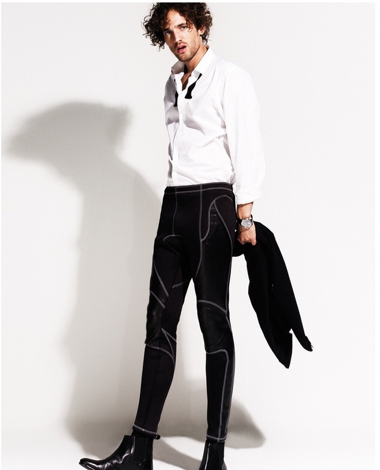

Riferimento: `PAGINA X LAYOUT STYLING GENERALE1.jpg`.

Utilizzi: `general-01-07.jpg`.

Richiesta: master completo della variante mostrata, mantenendo fotografia, formato ed eventuale testo pubblicitario.

## M05 · general-02-02

Riferimento: `PAGINA X LAYOUT STYLING GENERALE2.jpg`.

Utilizzi: `general-02-02.jpg`.

Richiesta: master completo della variante mostrata, mantenendo fotografia, formato ed eventuale testo pubblicitario.

## M06 · general-02-04

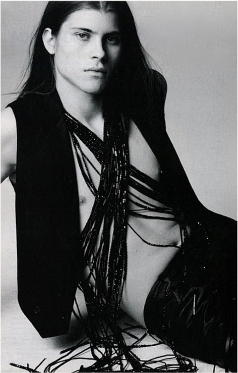

Riferimento: `PAGINA X LAYOUT STYLING GENERALE2.jpg`.

Utilizzi: `general-02-04.jpg`.

Richiesta: master completo della variante mostrata, mantenendo fotografia, formato ed eventuale testo pubblicitario.

## M07 · general-02-05

Riferimento: `PAGINA X LAYOUT STYLING GENERALE2.jpg`.

Utilizzi: `general-02-05.jpg`.

Richiesta: master completo della variante mostrata, mantenendo fotografia, formato ed eventuale testo pubblicitario.

## M08 · general-02-07

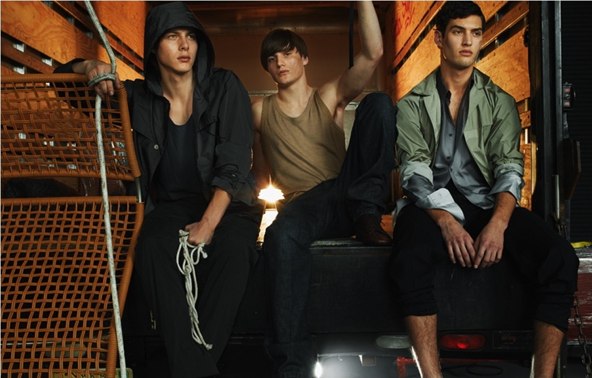

Riferimento: `PAGINA X LAYOUT STYLING GENERALE2.jpg`.

Utilizzi: `general-02-07.jpg`.

Richiesta: master completo della variante mostrata, mantenendo fotografia, formato ed eventuale testo pubblicitario.

## M09 · general-03-02

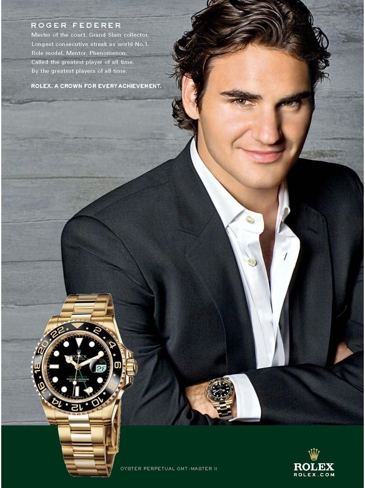

Riferimento: `PAGINA X LAYOUT STYLING GENERALE3.jpg`.

Utilizzi: `general-03-02.jpg`, `rolex-work-03.jpg`.

Richiesta: master completo della variante mostrata, mantenendo fotografia, formato ed eventuale testo pubblicitario.

## M10 · general-03-04

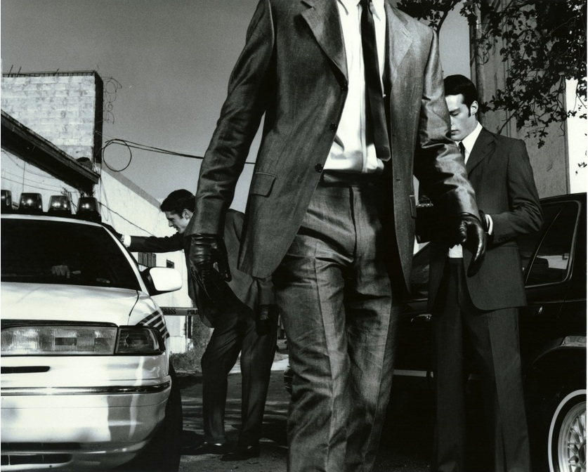

Riferimento: `PAGINA X LAYOUT STYLING GENERALE3.jpg`.

Utilizzi: `general-03-04.jpg`.

Richiesta: master completo della variante mostrata, mantenendo fotografia, formato ed eventuale testo pubblicitario.

## M11 · general-03-05

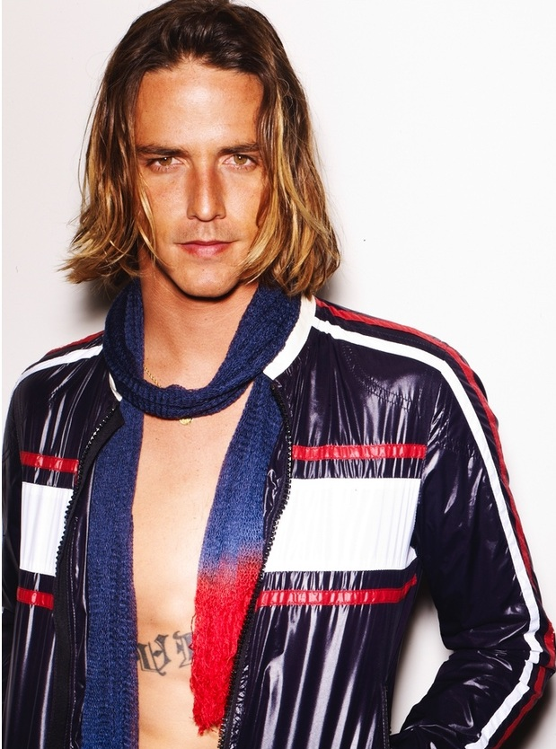

Riferimento: `PAGINA X LAYOUT STYLING GENERALE3.jpg`.

Utilizzi: `general-03-05.jpg`.

Richiesta: master completo della variante mostrata, mantenendo fotografia, formato ed eventuale testo pubblicitario.

## M12 · general-04-01

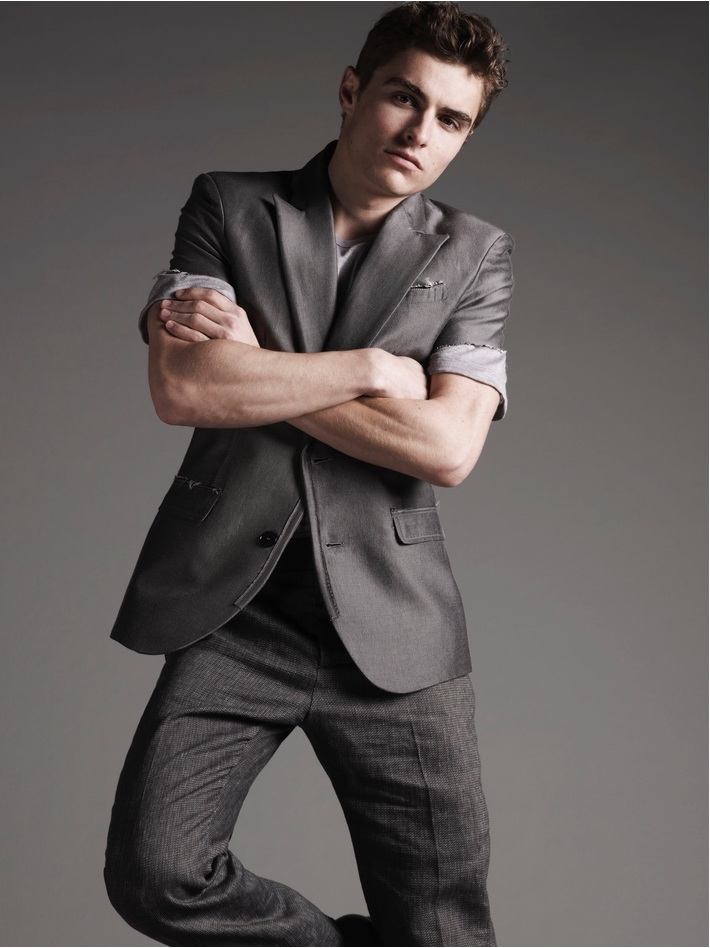

Riferimento: `PAGINA X LAYOUT STYLING GENERALE4.jpg`.

Utilizzi: `general-04-01.jpg`.

Richiesta: master completo della variante mostrata, mantenendo fotografia, formato ed eventuale testo pubblicitario.

## M13 · general-04-02

Riferimento: `PAGINA X LAYOUT STYLING GENERALE4.jpg`.

Utilizzi: `general-04-02.jpg`.

Richiesta: master completo della variante mostrata, mantenendo fotografia, formato ed eventuale testo pubblicitario.

## M14 · general-04-03

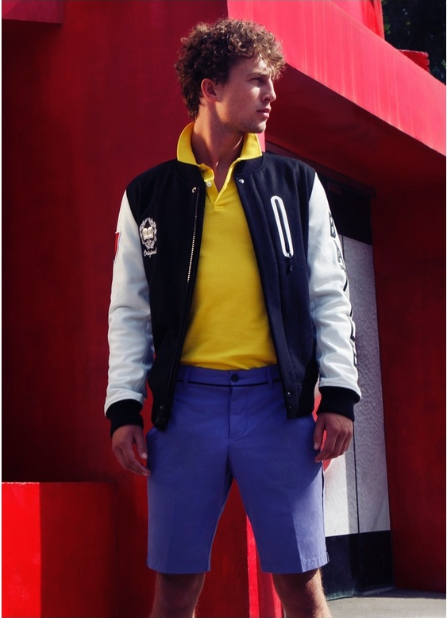

Riferimento: `PAGINA X LAYOUT STYLING GENERALE4.jpg`.

Utilizzi: `general-04-03.jpg`.

Richiesta: master completo della variante mostrata, mantenendo fotografia, formato ed eventuale testo pubblicitario.

## M15 · general-04-05

Riferimento: `PAGINA X LAYOUT STYLING GENERALE4.jpg`.

Utilizzi: `general-04-05.jpg`.

Richiesta: master completo della variante mostrata, mantenendo fotografia, formato ed eventuale testo pubblicitario.

## M16 · general-04-06

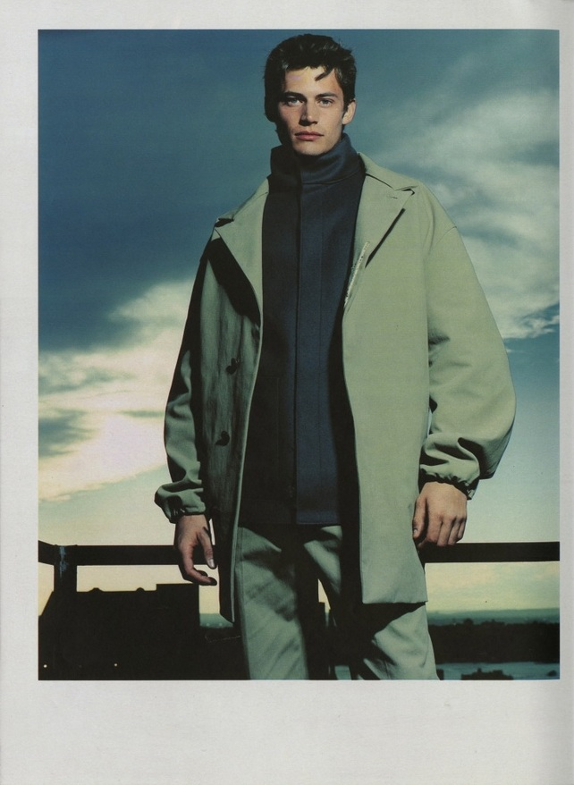

Riferimento: `PAGINA X LAYOUT STYLING GENERALE4.jpg`.

Utilizzi: `general-04-06.jpg`.

Richiesta: master completo della variante mostrata, mantenendo fotografia, formato ed eventuale testo pubblicitario.

## M17 · general-04-07

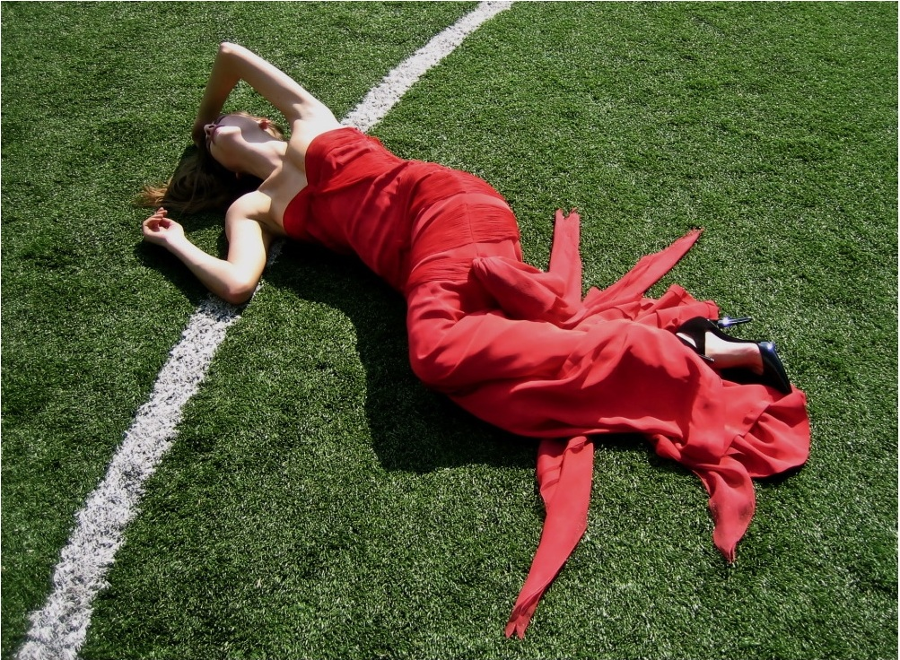

Riferimento: `PAGINA X LAYOUT STYLING GENERALE4.jpg`.

Utilizzi: `general-04-07.jpg`.

Richiesta: master completo della variante mostrata, mantenendo fotografia, formato ed eventuale testo pubblicitario.

## M18 · general-05-01

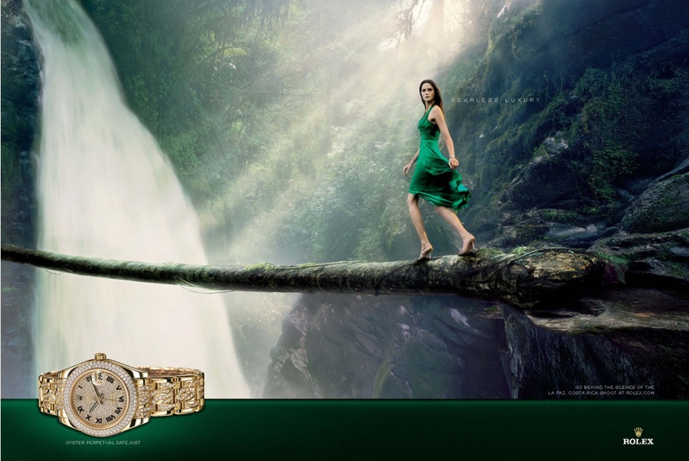

Riferimento: `PAGINA X LAYOUT STYLING GENERALE5.jpg`.

Utilizzi: `general-05-01.jpg`, `rolex-work-02.jpg`, `rolex-02-01.jpg`.

Richiesta: master completo della variante mostrata, mantenendo fotografia, formato ed eventuale testo pubblicitario.

## M19 · general-05-02

Riferimento: `PAGINA X LAYOUT STYLING GENERALE5.jpg`.

Utilizzi: `general-05-02.jpg`.

Richiesta: master completo della variante mostrata, mantenendo fotografia, formato ed eventuale testo pubblicitario.

## M20 · general-05-04

Riferimento: `PAGINA X LAYOUT STYLING GENERALE5.jpg`.

Utilizzi: `general-05-04.jpg`.

Richiesta: master completo della variante mostrata, mantenendo fotografia, formato ed eventuale testo pubblicitario.

## M21 · general-05-06

Riferimento: `PAGINA X LAYOUT STYLING GENERALE5.jpg`.

Utilizzi: `general-05-06.jpg`.

Richiesta: master completo della variante mostrata, mantenendo fotografia, formato ed eventuale testo pubblicitario.

## M22 · general-06-03

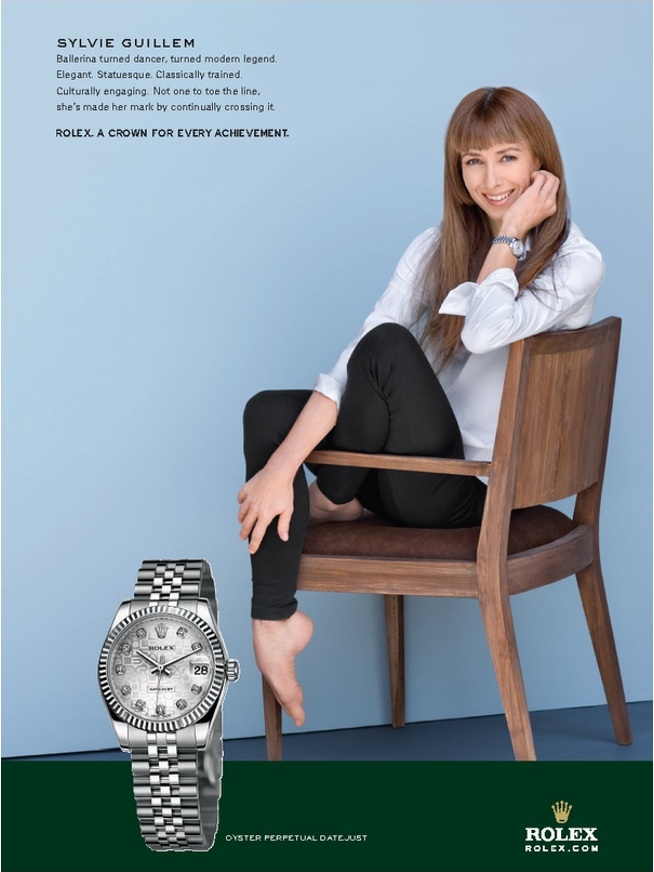

Riferimento: `PAGINA X LAYOUT STYLING GENERALE6.jpg`.

Utilizzi: `general-06-03.jpg`, `rolex-work-04.jpg`, `rolex-04-02.jpg`.

Richiesta: master completo della variante mostrata, mantenendo fotografia, formato ed eventuale testo pubblicitario.

## M23 · general-06-05

Riferimento: `PAGINA X LAYOUT STYLING GENERALE6.jpg`.

Utilizzi: `general-06-05.jpg`.

Richiesta: master completo della variante mostrata, mantenendo fotografia, formato ed eventuale testo pubblicitario.

## M24 · general-06-06

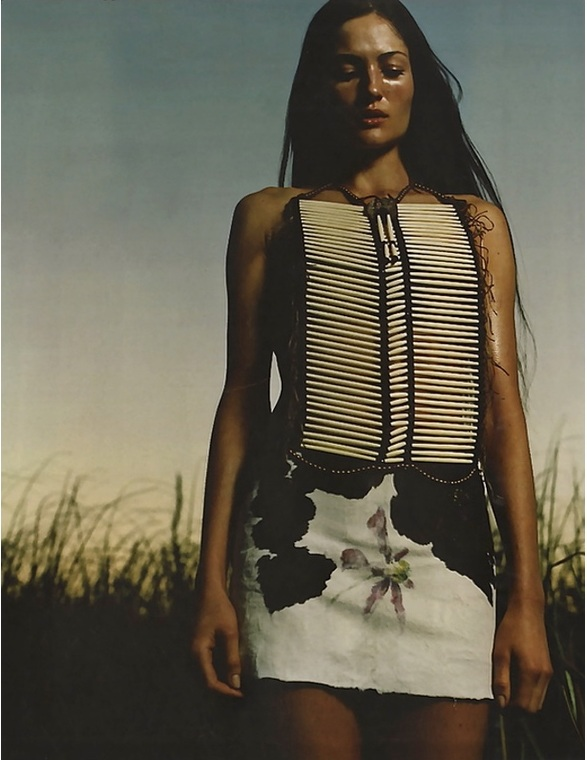

Riferimento: `PAGINA X LAYOUT STYLING GENERALE6.jpg`.

Utilizzi: `general-06-06.jpg`.

Richiesta: master completo della variante mostrata, mantenendo fotografia, formato ed eventuale testo pubblicitario.

## M25 · general-06-07

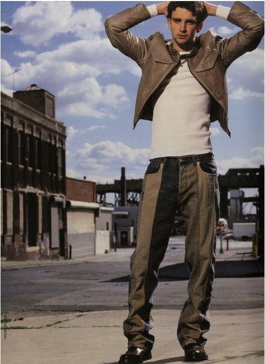

Riferimento: `PAGINA X LAYOUT STYLING GENERALE6.jpg`.

Utilizzi: `general-06-07.jpg`.

Richiesta: master completo della variante mostrata, mantenendo fotografia, formato ed eventuale testo pubblicitario.

## M26 · general-07-01

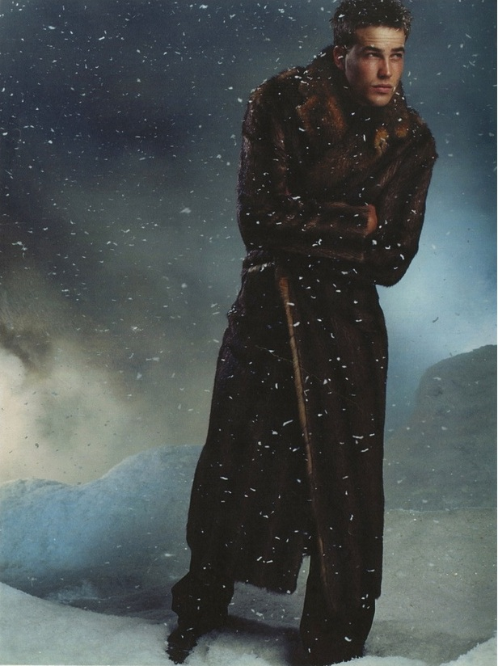

Riferimento: `PAGINA X LAYOUT STYLING GENERALE7.jpg`.

Utilizzi: `general-07-01.jpg`.

Richiesta: master completo della variante mostrata, mantenendo fotografia, formato ed eventuale testo pubblicitario.

## M27 · general-07-03

Riferimento: `PAGINA X LAYOUT STYLING GENERALE7.jpg`.

Utilizzi: `general-07-03.jpg`.

Richiesta: master completo della variante mostrata, mantenendo fotografia, formato ed eventuale testo pubblicitario.

## M28 · general-07-04

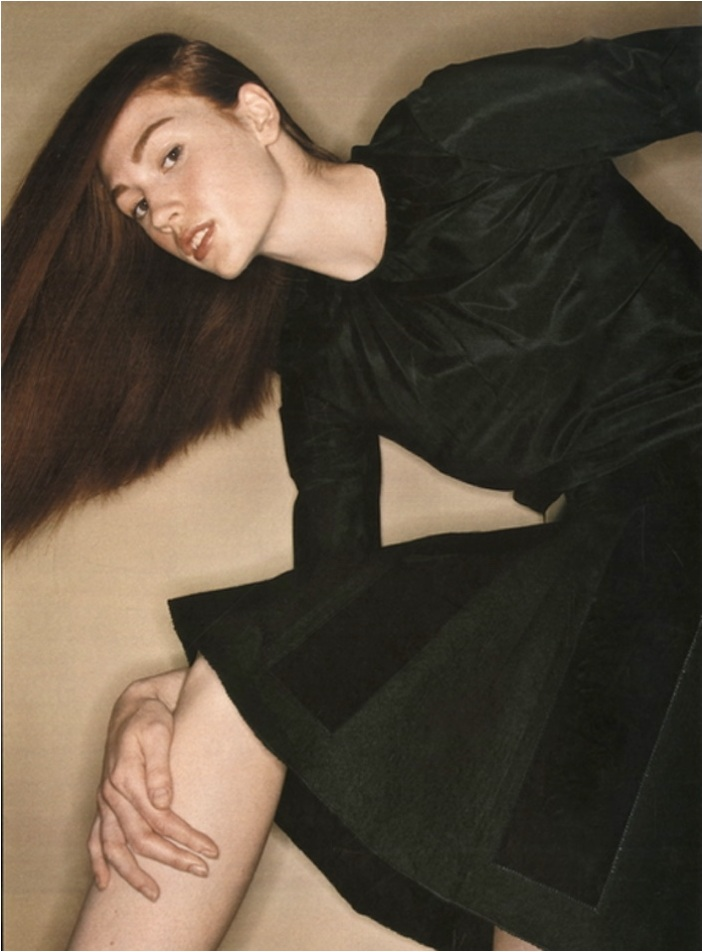

Riferimento: `PAGINA X LAYOUT STYLING GENERALE7.jpg`.

Utilizzi: `general-07-04.jpg`.

Richiesta: master completo della variante mostrata, mantenendo fotografia, formato ed eventuale testo pubblicitario.

## M29 · general-07-05

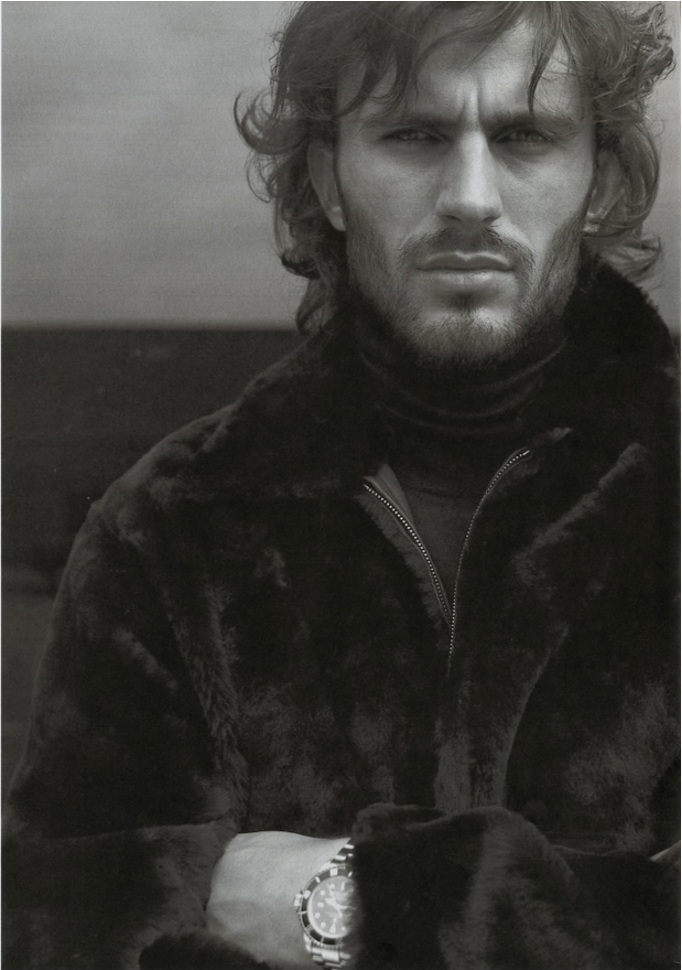

Riferimento: `PAGINA X LAYOUT STYLING GENERALE7.jpg`.

Utilizzi: `general-07-05.jpg`.

Richiesta: master completo della variante mostrata, mantenendo fotografia, formato ed eventuale testo pubblicitario.

## M30 · general-07-06

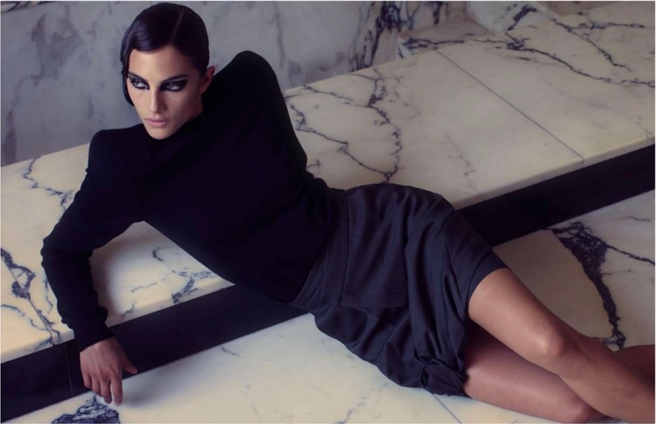

Riferimento: `PAGINA X LAYOUT STYLING GENERALE7.jpg`.

Utilizzi: `general-07-06.jpg`.

Richiesta: master completo della variante mostrata, mantenendo fotografia, formato ed eventuale testo pubblicitario.

## M31 · general-08-01

Riferimento: `PAGINA X LAYOUT STYLING GENERALE8.jpg`.

Utilizzi: `general-08-01.jpg`.

Richiesta: master completo della variante mostrata, mantenendo fotografia, formato ed eventuale testo pubblicitario.

## M32 · general-08-03

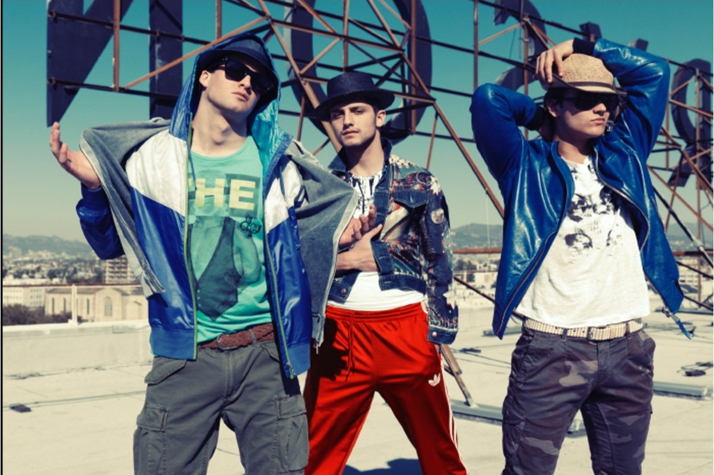

Riferimento: `PAGINA X LAYOUT STYLING GENERALE8.jpg`.

Utilizzi: `general-08-03.jpg`.

Richiesta: master completo della variante mostrata, mantenendo fotografia, formato ed eventuale testo pubblicitario.

## M33 · general-08-04

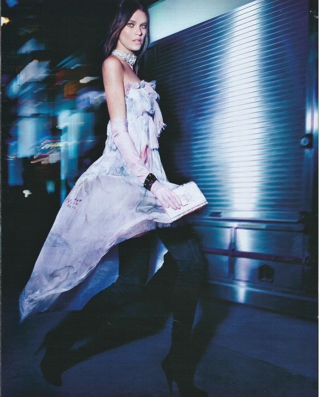

Riferimento: `PAGINA X LAYOUT STYLING GENERALE8.jpg`.

Utilizzi: `general-08-04.jpg`.

Richiesta: master completo della variante mostrata, mantenendo fotografia, formato ed eventuale testo pubblicitario.

## M34 · general-08-05

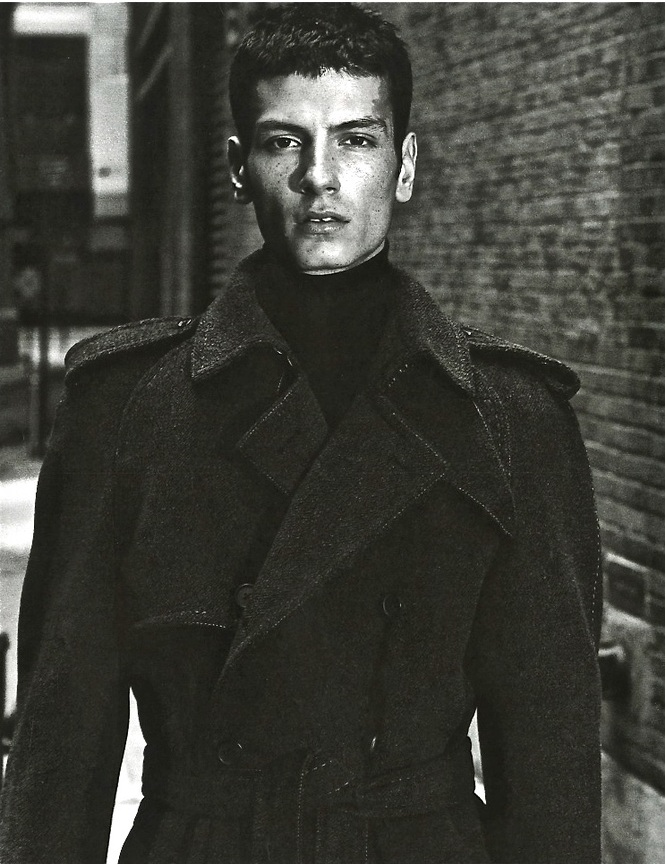

Riferimento: `PAGINA X LAYOUT STYLING GENERALE8.jpg`.

Utilizzi: `general-08-05.jpg`.

Richiesta: master completo della variante mostrata, mantenendo fotografia, formato ed eventuale testo pubblicitario.

## M35 · general-08-06

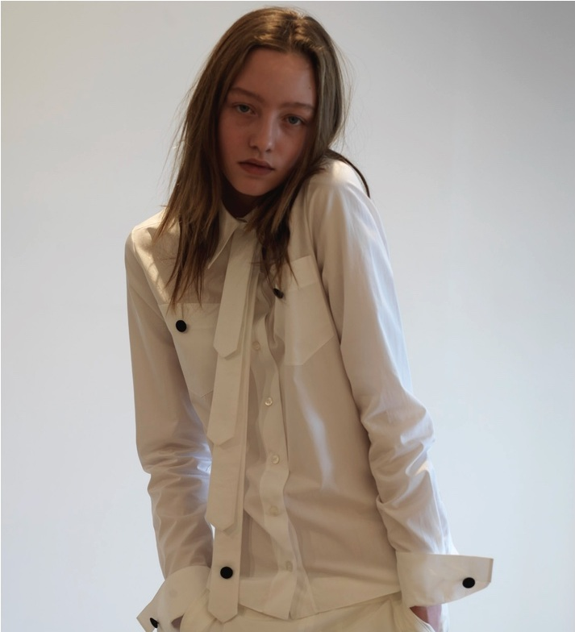

Riferimento: `PAGINA X LAYOUT STYLING GENERALE8.jpg`.

Utilizzi: `general-08-06.jpg`.

Richiesta: master completo della variante mostrata, mantenendo fotografia, formato ed eventuale testo pubblicitario.

## M36 · general-09-01

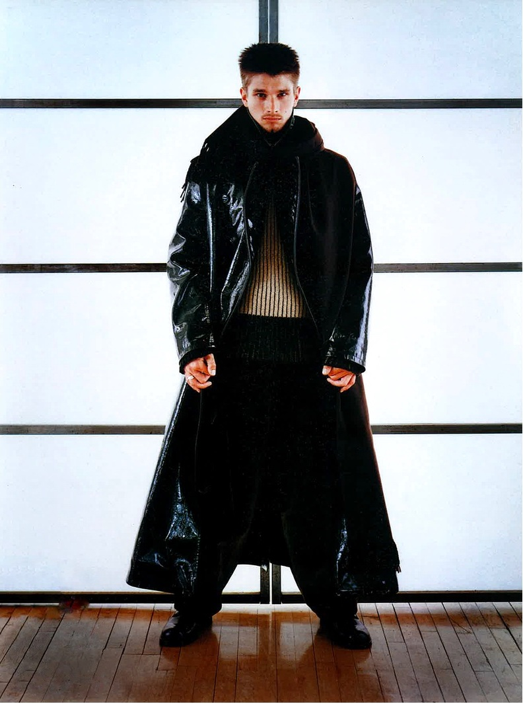

Riferimento: `PAGINA X LAYOUT STYLING GENERALE9.jpg`.

Utilizzi: `general-09-01.jpg`.

Richiesta: master completo della variante mostrata, mantenendo fotografia, formato ed eventuale testo pubblicitario.

## M37 · general-09-02

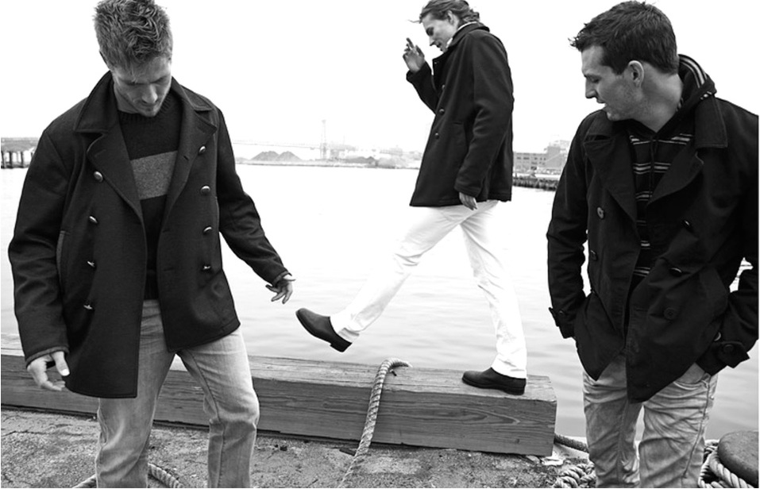

Riferimento: `PAGINA X LAYOUT STYLING GENERALE9.jpg`.

Utilizzi: `general-09-02.jpg`.

Richiesta: master completo della variante mostrata, mantenendo fotografia, formato ed eventuale testo pubblicitario.

## M38 · general-09-05

Riferimento: `PAGINA X LAYOUT STYLING GENERALE9.jpg`.

Utilizzi: `general-09-05.jpg`.

Richiesta: master completo della variante mostrata, mantenendo fotografia, formato ed eventuale testo pubblicitario.

## M39 · general-09-06

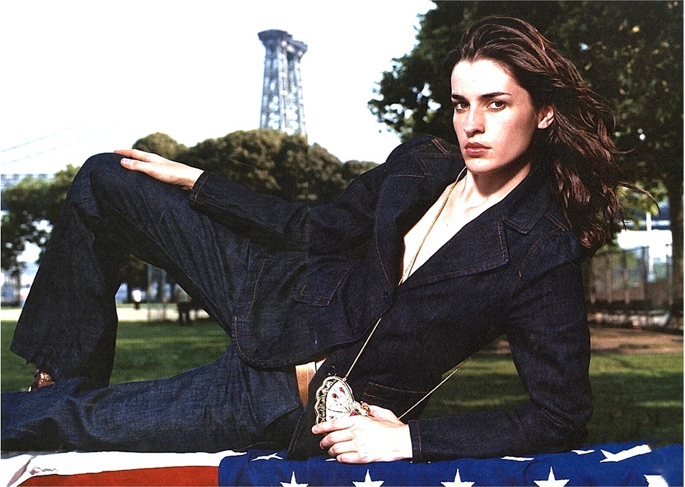

Riferimento: `PAGINA X LAYOUT STYLING GENERALE9.jpg`.

Utilizzi: `general-09-06.jpg`.

Richiesta: master completo della variante mostrata, mantenendo fotografia, formato ed eventuale testo pubblicitario.

## M40 · general-10-02

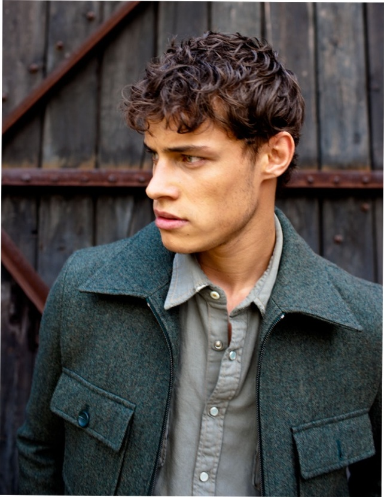

Riferimento: `PAGINA X LAYOUT STYLING GENERALE10.jpg`.

Utilizzi: `general-10-02.jpg`.

Richiesta: master completo della variante mostrata, mantenendo fotografia, formato ed eventuale testo pubblicitario.

## M41 · men-04-03

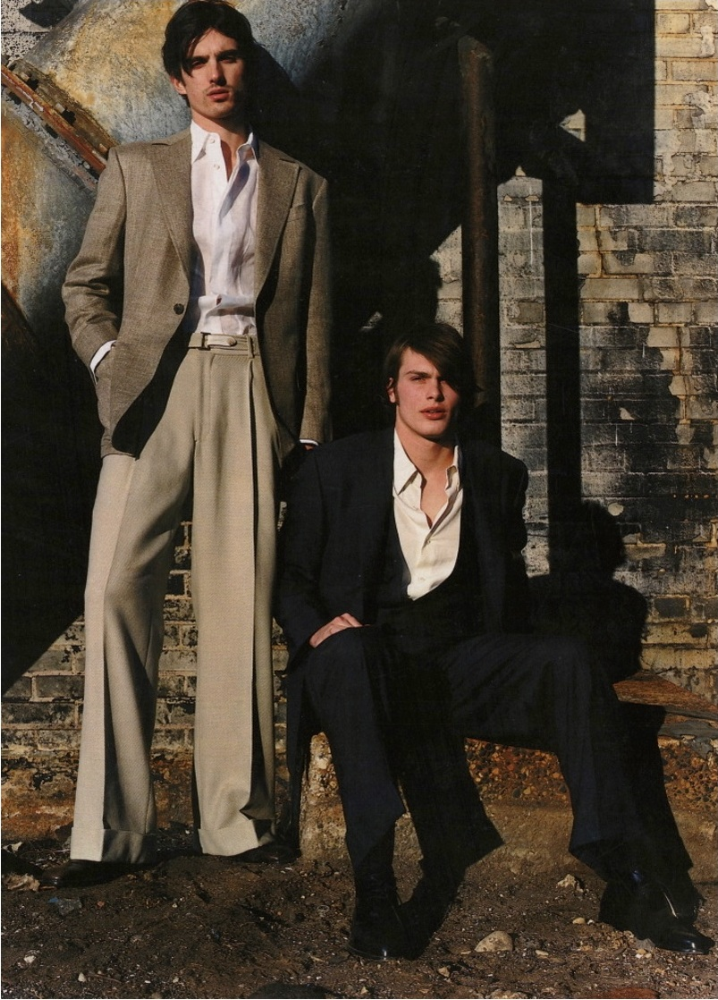

Riferimento: `PAGINA X LAYOUT STYLING MEN4.jpg`.

Utilizzi: `men-04-03.jpg`.

Richiesta: master completo della variante mostrata, mantenendo fotografia, formato ed eventuale testo pubblicitario.

## M42 · men-05-02

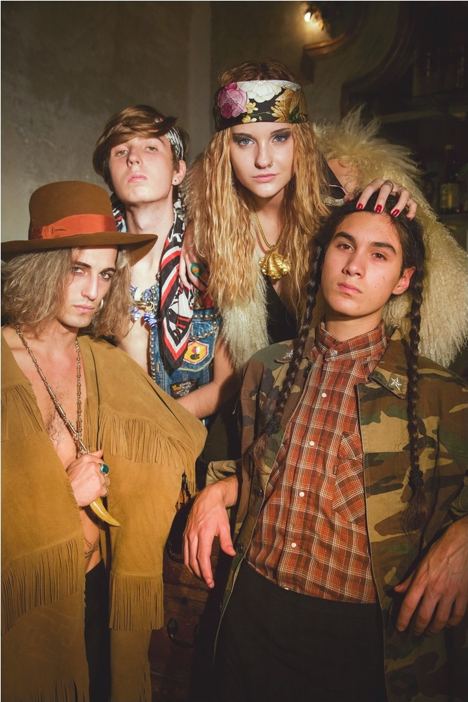

Riferimento: `PAGINA X LAYOUT STYLING MEN5.jpg`.

Utilizzi: `men-05-02.jpg`.

Richiesta: master completo della variante mostrata, mantenendo fotografia, formato ed eventuale testo pubblicitario.

## M43 · men-05-04

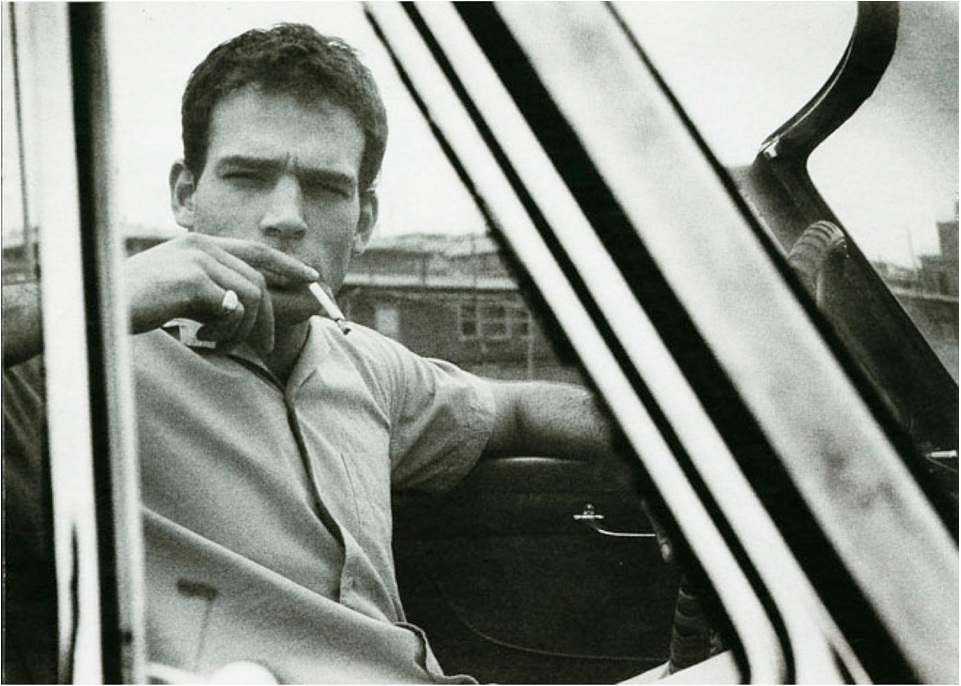

Riferimento: `PAGINA X LAYOUT STYLING MEN5.jpg`.

Utilizzi: `men-05-04.jpg`.

Richiesta: master completo della variante mostrata, mantenendo fotografia, formato ed eventuale testo pubblicitario.

## M44 · rolex-02-02

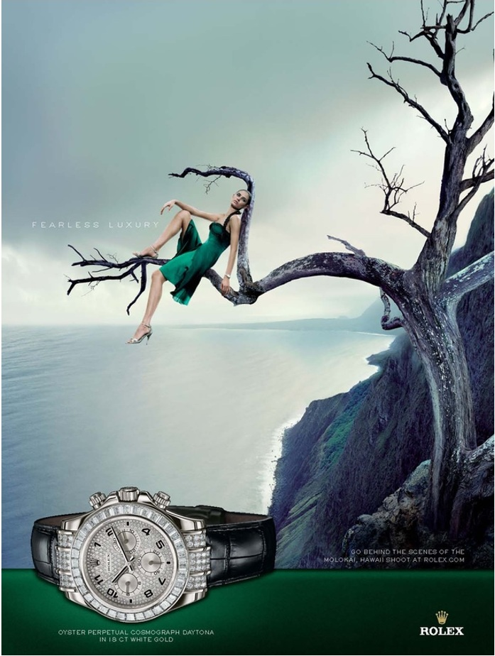

Riferimento: `PAGINA X LAYOUT ROLEX2.jpg`.

Utilizzi: `rolex-02-02.jpg`.

Richiesta: master completo della variante mostrata, mantenendo fotografia, formato ed eventuale testo pubblicitario.

## M45 · rolex-02-03

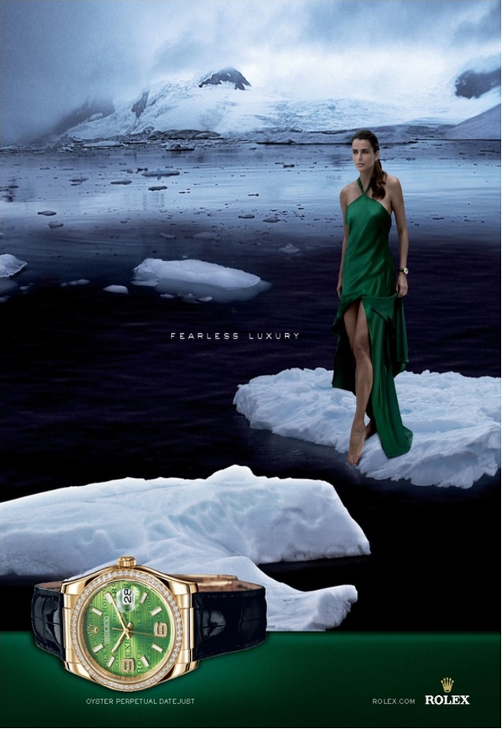

Riferimento: `PAGINA X LAYOUT ROLEX2.jpg`.

Utilizzi: `rolex-02-03.jpg`.

Richiesta: master completo della variante mostrata, mantenendo fotografia, formato ed eventuale testo pubblicitario.

## M46 · rolex-02-04

Riferimento: `PAGINA X LAYOUT ROLEX2.jpg`.

Utilizzi: `rolex-02-04.jpg`.

Richiesta: master completo della variante mostrata, mantenendo fotografia, formato ed eventuale testo pubblicitario.

## M47 · rolex-03-01

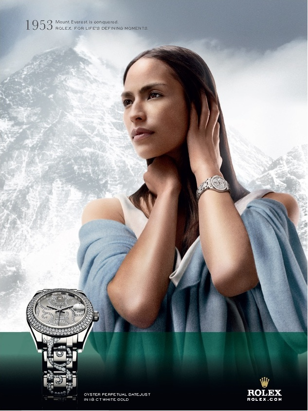

Riferimento: `PAGINA X LAYOUT ROLEX3.jpg`.

Utilizzi: `rolex-03-01.jpg`.

Richiesta: master completo della variante mostrata, mantenendo fotografia, formato ed eventuale testo pubblicitario.

## M48 · rolex-03-02

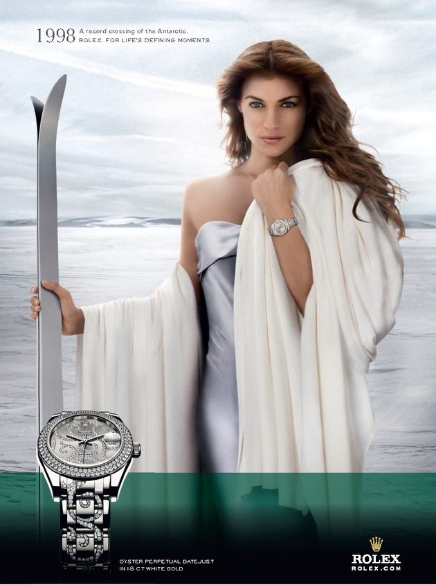

Riferimento: `PAGINA X LAYOUT ROLEX3.jpg`.

Utilizzi: `rolex-03-02.jpg`.

Richiesta: master completo della variante mostrata, mantenendo fotografia, formato ed eventuale testo pubblicitario.

## M49 · rolex-03-03

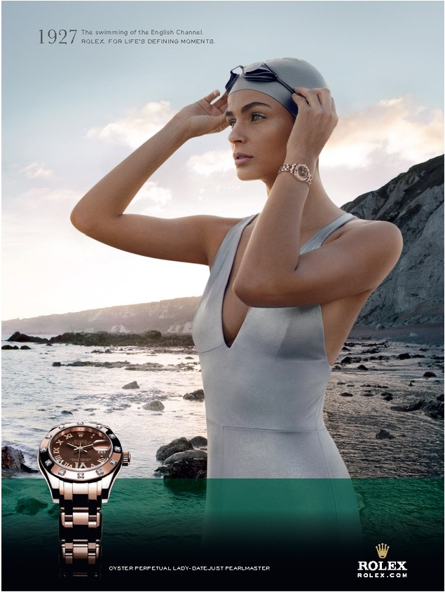

Riferimento: `PAGINA X LAYOUT ROLEX3.jpg`.

Utilizzi: `rolex-03-03.jpg`.

Richiesta: master completo della variante mostrata, mantenendo fotografia, formato ed eventuale testo pubblicitario.

## M50 · rolex-03-04

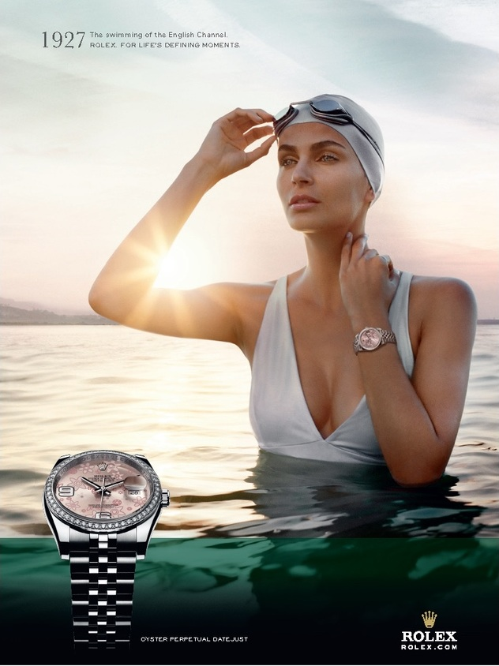

Riferimento: `PAGINA X LAYOUT ROLEX3.jpg`.

Utilizzi: `rolex-03-04.jpg`.

Richiesta: master completo della variante mostrata, mantenendo fotografia, formato ed eventuale testo pubblicitario.

## M51 · rolex-03-05

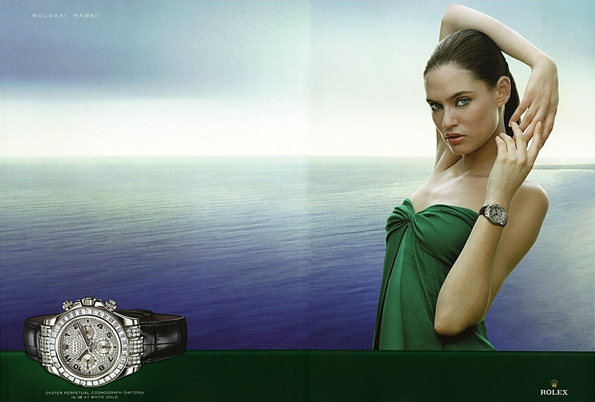

Riferimento: `PAGINA X LAYOUT ROLEX3.jpg`.

Utilizzi: `rolex-03-05.jpg`.

Richiesta: master completo della variante mostrata, mantenendo fotografia, formato ed eventuale testo pubblicitario.

## M52 · rolex-04-01

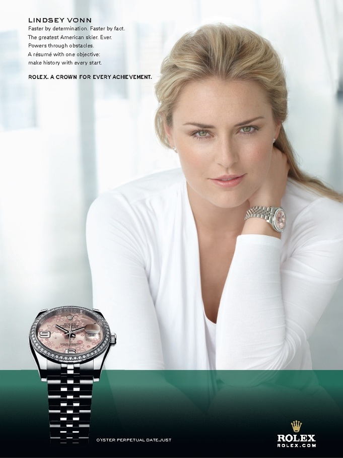

Riferimento: `PAGINA X LAYOUT ROLEX4.jpg`.

Utilizzi: `rolex-04-01.jpg`.

Richiesta: master completo della variante mostrata, mantenendo fotografia, formato ed eventuale testo pubblicitario.

## M53 · rolex-04-03

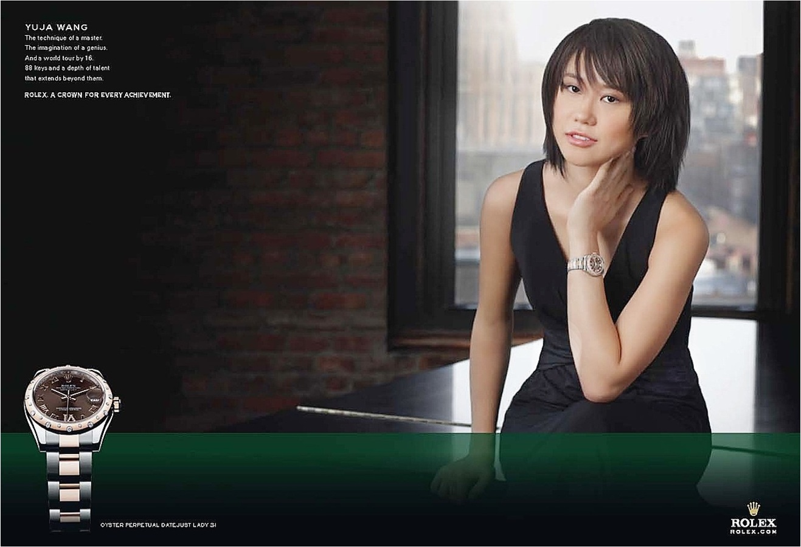

Riferimento: `PAGINA X LAYOUT ROLEX4.jpg`.

Utilizzi: `rolex-04-03.jpg`.

Richiesta: master completo della variante mostrata, mantenendo fotografia, formato ed eventuale testo pubblicitario.

## M54 · rolex-04-04

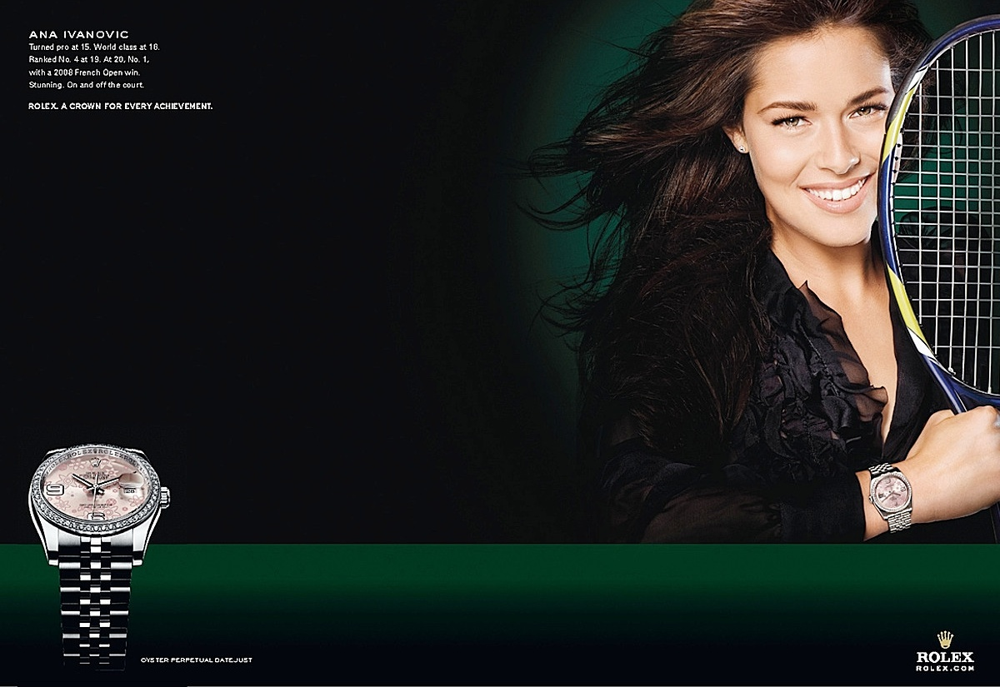

Riferimento: `PAGINA X LAYOUT ROLEX4.jpg`.

Utilizzi: `rolex-04-04.jpg`.

Richiesta: master completo della variante mostrata, mantenendo fotografia, formato ed eventuale testo pubblicitario.

## M55 · rolex-04-05

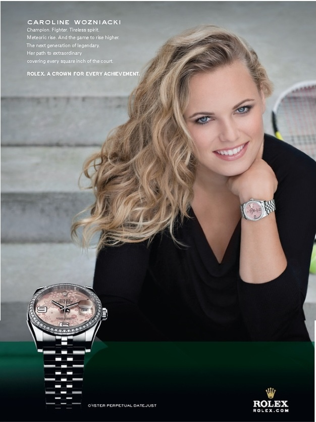

Riferimento: `PAGINA X LAYOUT ROLEX4.jpg`.

Utilizzi: `rolex-04-05.jpg`.

Richiesta: master completo della variante mostrata, mantenendo fotografia, formato ed eventuale testo pubblicitario.

## M56 · rolex-05-01

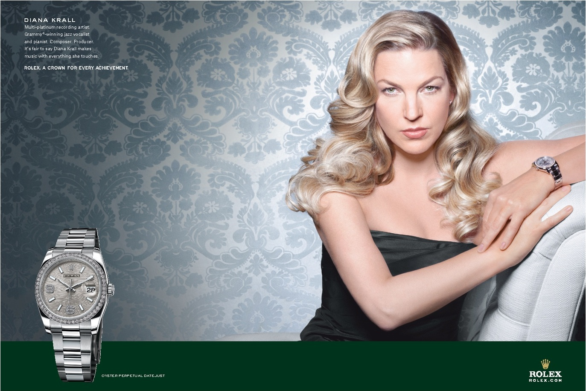

Riferimento: `PAGINA X LAYOUT ROLEX5.jpg`.

Utilizzi: `rolex-05-01.jpg`.

Richiesta: master completo della variante mostrata, mantenendo fotografia, formato ed eventuale testo pubblicitario.

## M57 · rolex-05-02

Riferimento: `PAGINA X LAYOUT ROLEX5.jpg`.

Utilizzi: `rolex-05-02.jpg`.

Richiesta: master completo della variante mostrata, mantenendo fotografia, formato ed eventuale testo pubblicitario.

## M58 · rolex-05-03

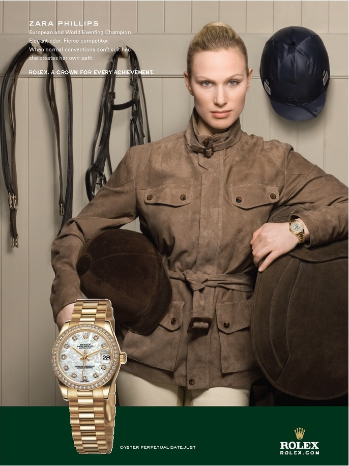

Riferimento: `PAGINA X LAYOUT ROLEX5.jpg`.

Utilizzi: `rolex-05-03.jpg`.

Richiesta: master completo della variante mostrata, mantenendo fotografia, formato ed eventuale testo pubblicitario.

## M59 · rolex-05-04

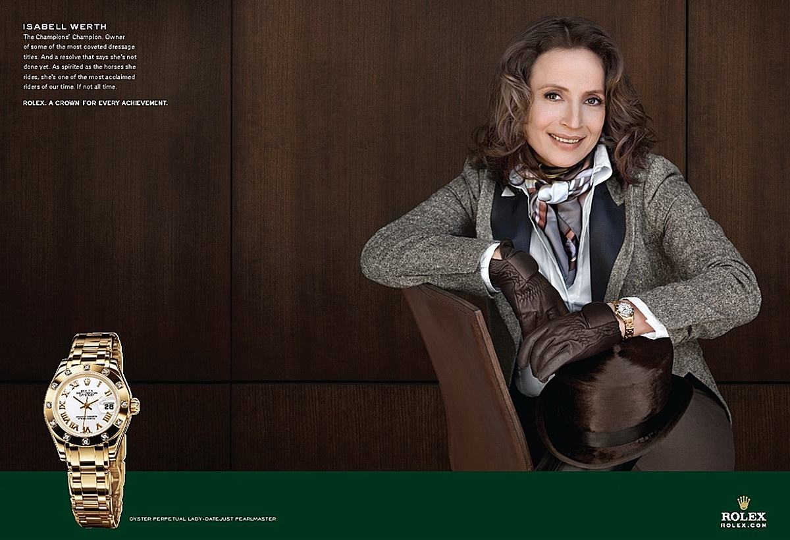

Riferimento: `PAGINA X LAYOUT ROLEX5.jpg`.

Utilizzi: `rolex-05-04.jpg`.

Richiesta: master completo della variante mostrata, mantenendo fotografia, formato ed eventuale testo pubblicitario.

## M60 · rolex-06-01

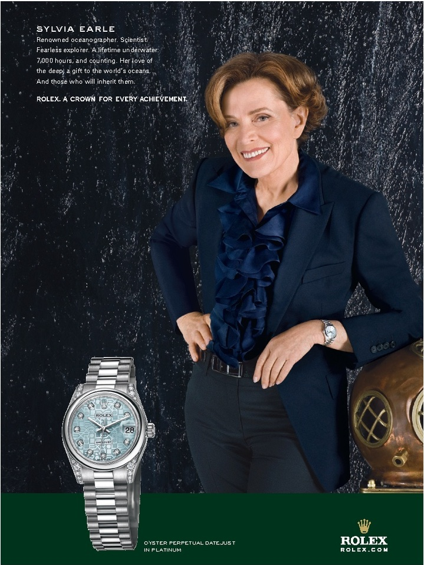

Riferimento: `PAGINA X LAYOUT ROLEX6.jpg`.

Utilizzi: `rolex-06-01.jpg`.

Richiesta: master completo della variante mostrata, mantenendo fotografia, formato ed eventuale testo pubblicitario.

## M61 · rolex-06-02

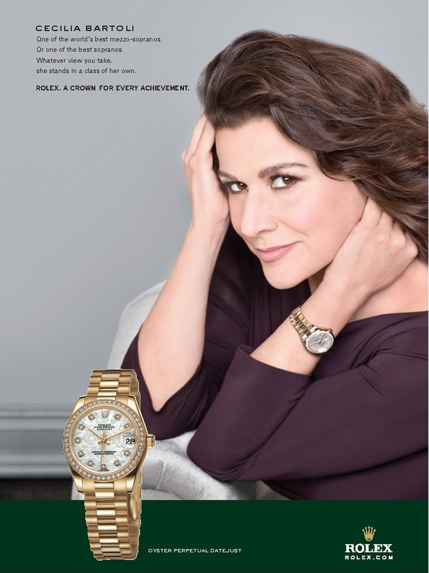

Riferimento: `PAGINA X LAYOUT ROLEX6.jpg`.

Utilizzi: `rolex-06-02.jpg`.

Richiesta: master completo della variante mostrata, mantenendo fotografia, formato ed eventuale testo pubblicitario.

## M62 · rolex-06-03

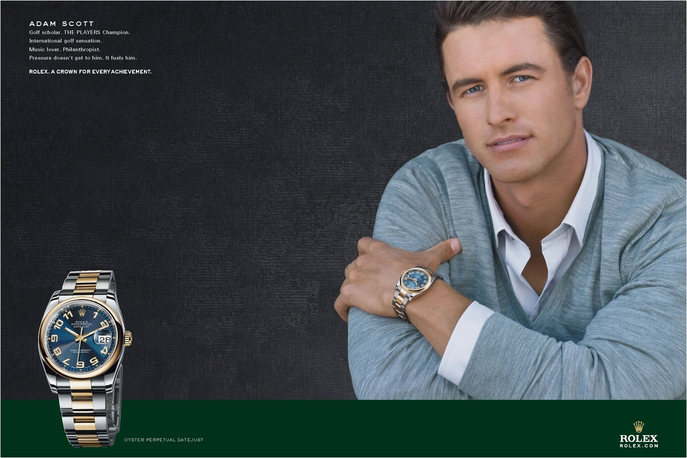

Riferimento: `PAGINA X LAYOUT ROLEX6.jpg`.

Utilizzi: `rolex-06-03.jpg`.

Richiesta: master completo della variante mostrata, mantenendo fotografia, formato ed eventuale testo pubblicitario.

## M63 · rolex-06-04

Riferimento: `PAGINA X LAYOUT ROLEX6.jpg`.

Utilizzi: `rolex-06-04.jpg`.

Richiesta: master completo della variante mostrata, mantenendo fotografia, formato ed eventuale testo pubblicitario.

## M64 · rolex-06-05

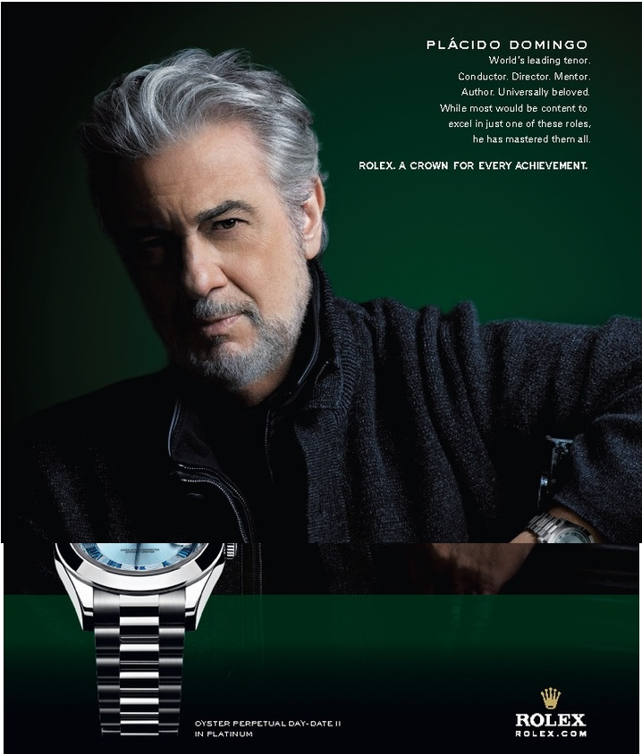

Riferimento: `PAGINA X LAYOUT ROLEX6.jpg`.

Utilizzi: `rolex-06-05.jpg`.

Richiesta: master completo della variante mostrata, mantenendo fotografia, formato ed eventuale testo pubblicitario.

## M65 · rolex-07-01

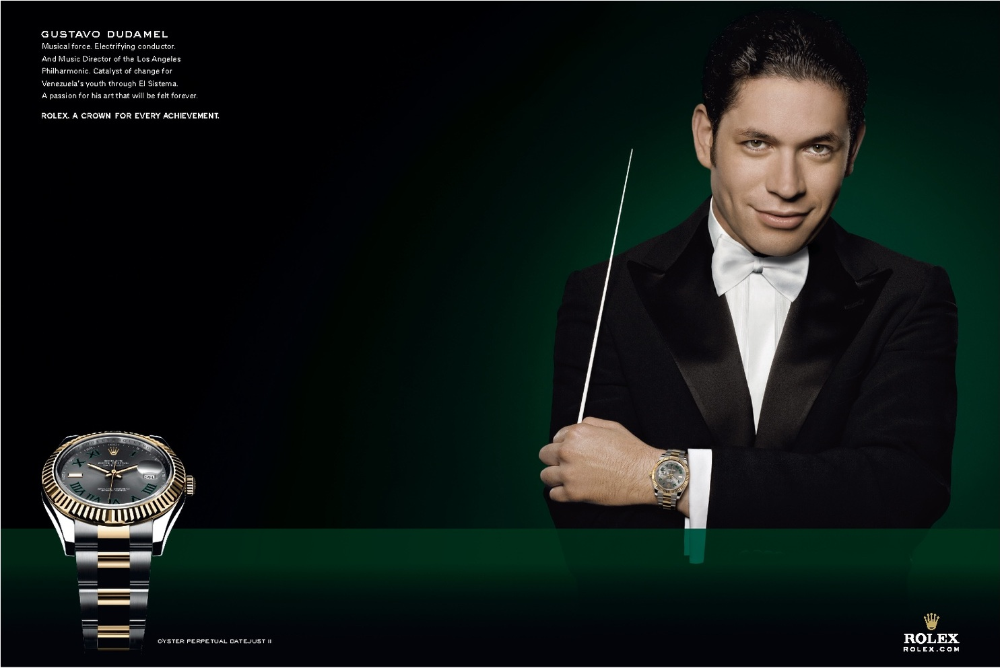

Riferimento: `PAGINA X LAYOUT ROLEX7.jpg`.

Utilizzi: `rolex-07-01.jpg`.

Richiesta: master completo della variante mostrata, mantenendo fotografia, formato ed eventuale testo pubblicitario.

## M66 · rolex-07-02

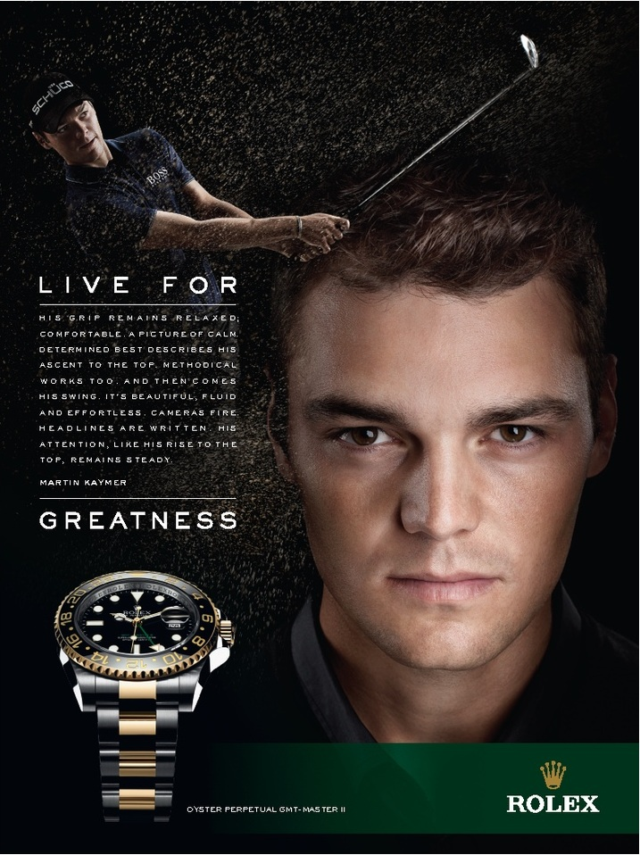

Riferimento: `PAGINA X LAYOUT ROLEX7.jpg`.

Utilizzi: `rolex-07-02.jpg`.

Richiesta: master completo della variante mostrata, mantenendo fotografia, formato ed eventuale testo pubblicitario.

## M67 · rolex-07-03

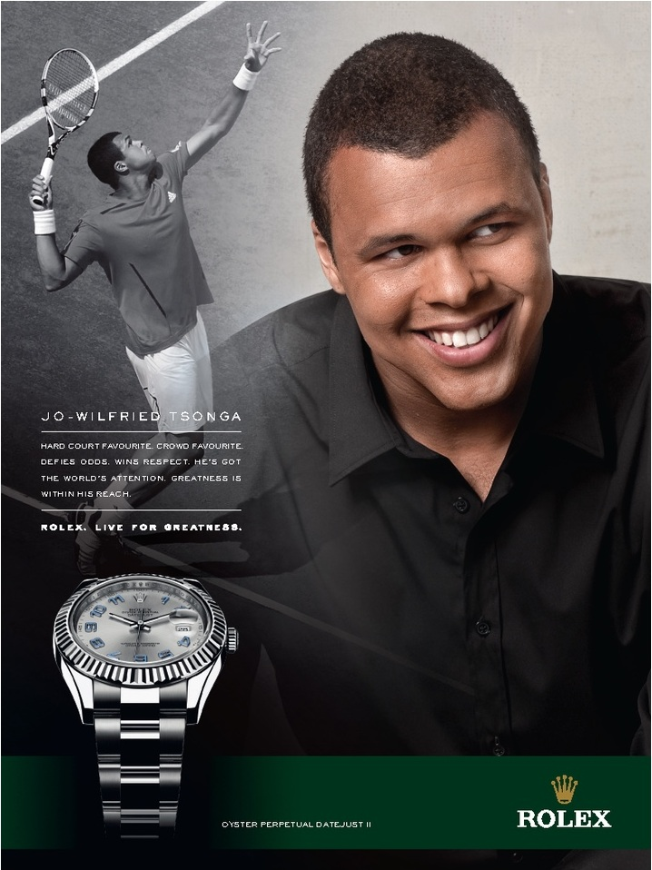

Riferimento: `PAGINA X LAYOUT ROLEX7.jpg`.

Utilizzi: `rolex-07-03.jpg`.

Richiesta: master completo della variante mostrata, mantenendo fotografia, formato ed eventuale testo pubblicitario.

## M68 · rolex-07-04

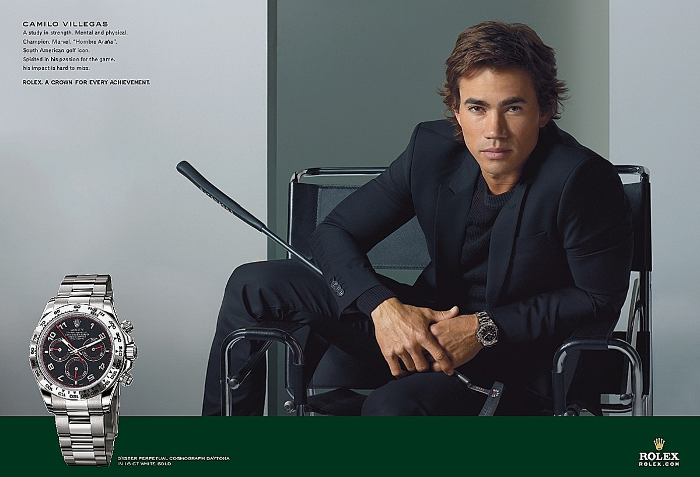

Riferimento: `PAGINA X LAYOUT ROLEX7.jpg`.

Utilizzi: `rolex-07-04.jpg`.

Richiesta: master completo della variante mostrata, mantenendo fotografia, formato ed eventuale testo pubblicitario.

## M69 · rolex-08-01

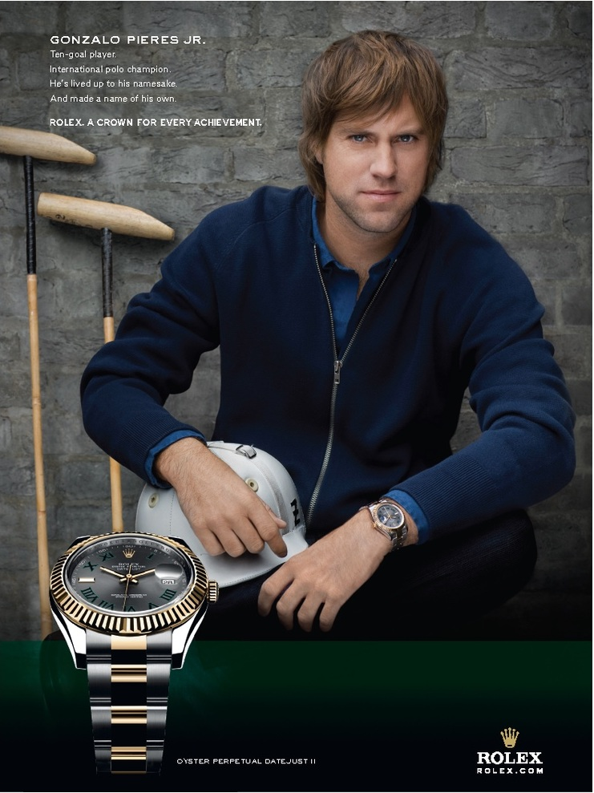

Riferimento: `PAGINA X LAYOUT ROLEX8.jpg`.

Utilizzi: `rolex-08-01.jpg`.

Richiesta: master completo della variante mostrata, mantenendo fotografia, formato ed eventuale testo pubblicitario.

## M70 · rolex-08-02

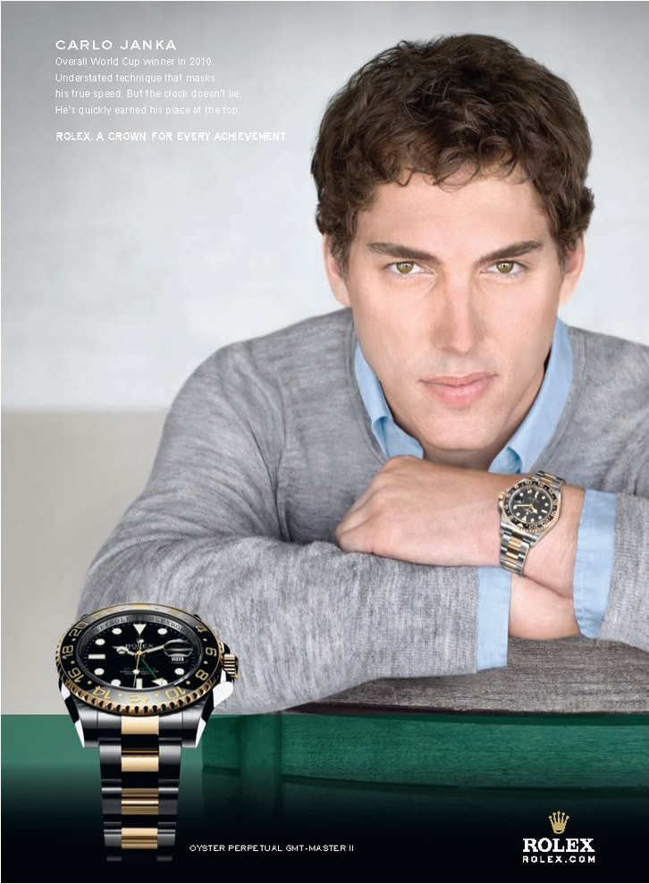

Riferimento: `PAGINA X LAYOUT ROLEX8.jpg`.

Utilizzi: `rolex-08-02.jpg`.

Richiesta: master completo della variante mostrata, mantenendo fotografia, formato ed eventuale testo pubblicitario.

## M71 · rolex-08-03

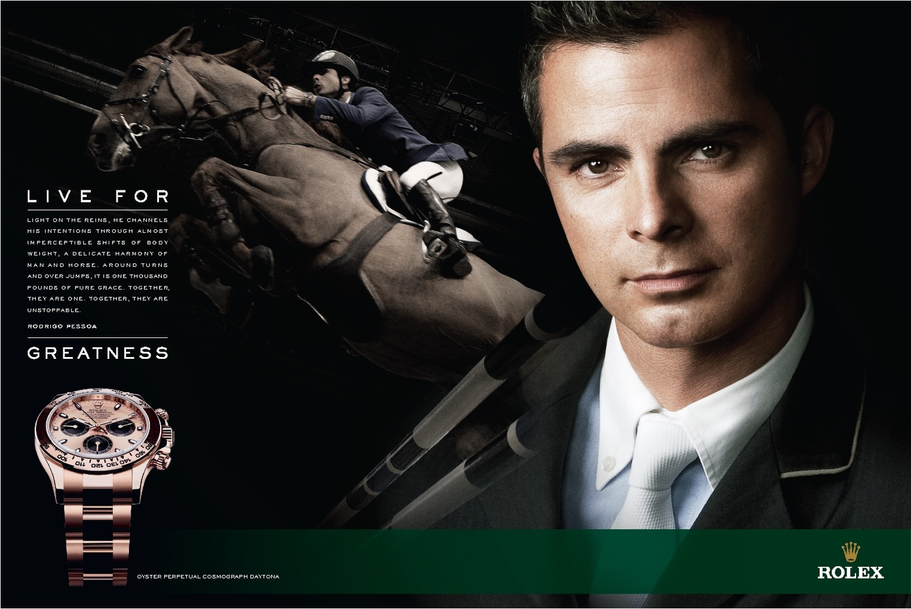

Riferimento: `PAGINA X LAYOUT ROLEX8.jpg`.

Utilizzi: `rolex-08-03.jpg`.

Richiesta: master completo della variante mostrata, mantenendo fotografia, formato ed eventuale testo pubblicitario.

## M72 · rolex-08-04

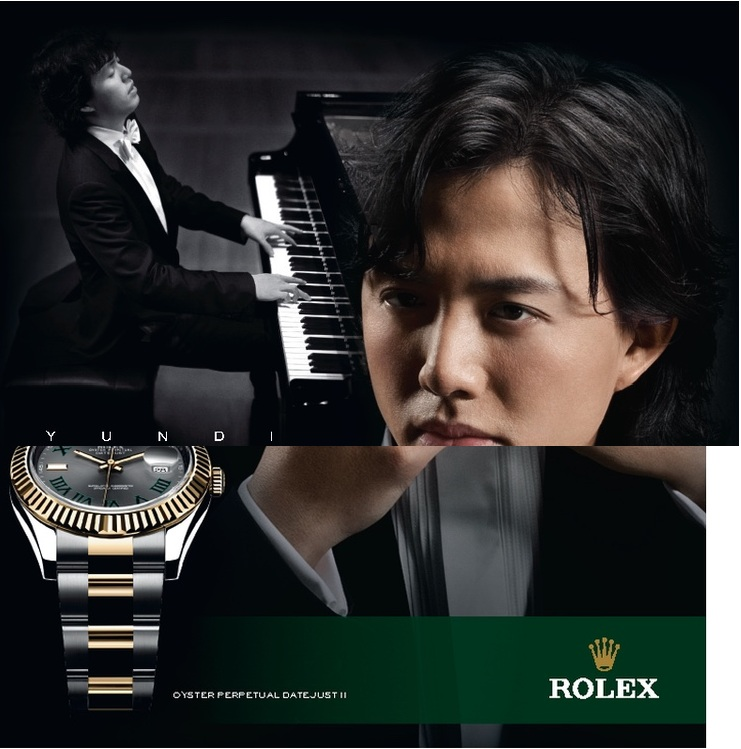

Riferimento: `PAGINA X LAYOUT ROLEX8.jpg`.

Utilizzi: `rolex-08-04.jpg`.

Richiesta: master completo della variante mostrata, mantenendo fotografia, formato ed eventuale testo pubblicitario.

## M73 · rolex-08-05

Riferimento: `PAGINA X LAYOUT ROLEX8.jpg`.

Utilizzi: `rolex-08-05.jpg`.

Richiesta: master completo della variante mostrata, mantenendo fotografia, formato ed eventuale testo pubblicitario.

## M74 · rolex-09-01

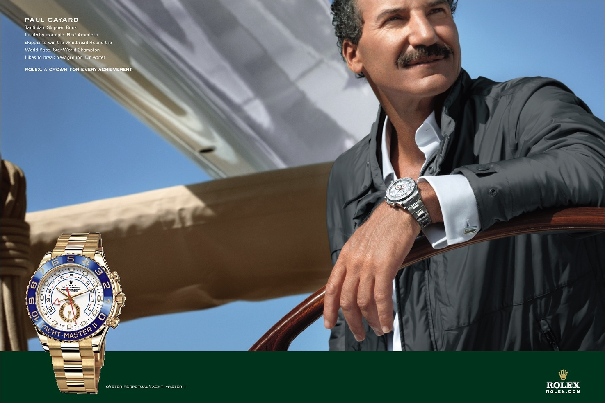

Riferimento: `PAGINA X LAYOUT ROLEX9.jpg`.

Utilizzi: `rolex-09-01.jpg`.

Richiesta: master completo della variante mostrata, mantenendo fotografia, formato ed eventuale testo pubblicitario.

## M75 · rolex-09-02

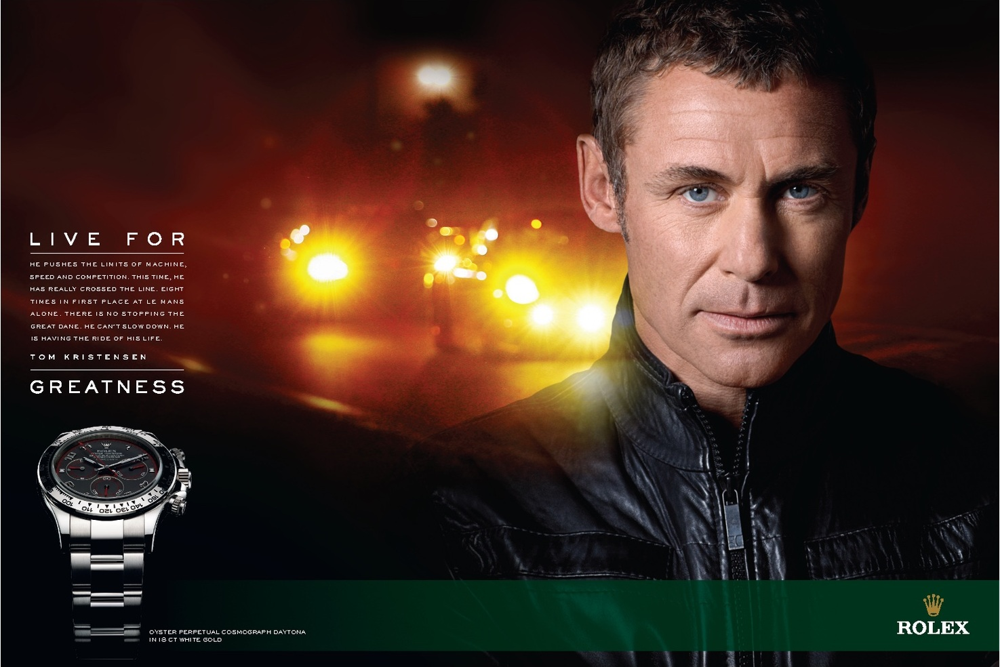

Riferimento: `PAGINA X LAYOUT ROLEX9.jpg`.

Utilizzi: `rolex-09-02.jpg`.

Richiesta: master completo della variante mostrata, mantenendo fotografia, formato ed eventuale testo pubblicitario.
